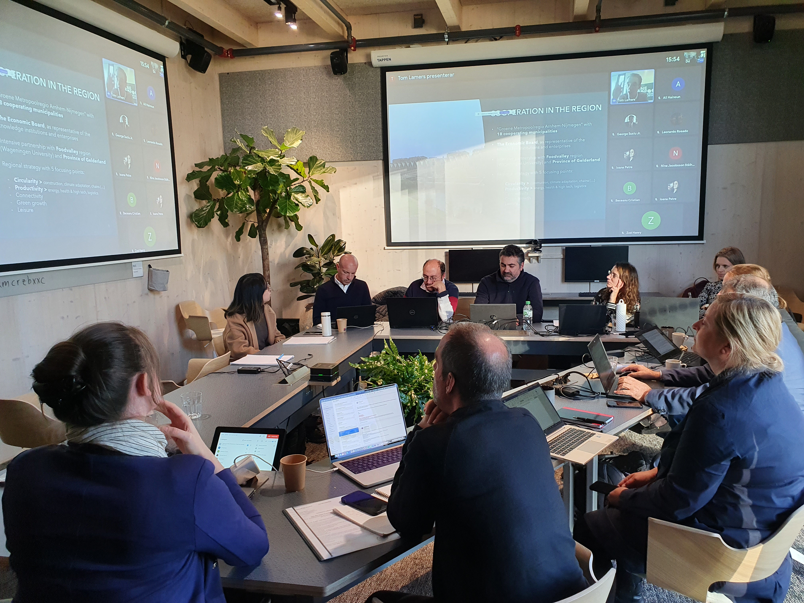

On October 20-21, the first physical meeting of all project partners took place at Universeum (20/10) and Chalmers conference centrum (21/10). 15 project partners were able to travel to Sweden and contribute to a very productive and intense meeting. Urban LivingLabs from Rennes (France), Arnhem/Nijmegen (The Netherlands) and Gothenburg (Sweden) were introduced. The next physical project meeting will very likely take place in Rennes in June 2023.  
   
<strong> Read more </strong>
  
[See the UrbanEurope project page]( https://jpi-urbaneurope.eu/project/create/)  
[See the CREATE project]() 
