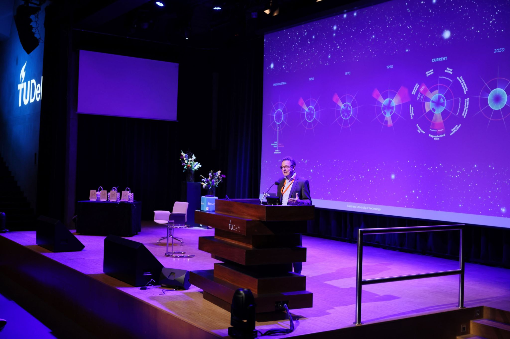

The Sustainable Built Environment conference 2022, hosted by TU Delft on October 11-13, had a focus on “Innovations for the Urban Energy Transition – Preparing for the European Renovation Wave”. Several researchers from Chalmers presented their work at the conference. Daniela Maiullari presented the first outcome of the project “Digtial Twin Energy” with the title [“Pathways towards carbon neutrality: A participatory analysis of the Gothenburg’s energy plan”](https://iopscience.iop.org/article/10.1088/1755-1315/1085/1/012041). Holger Wallbaum provided a keynote on “Challenges for a Sustainable Energy Transition in the Built Environment – Reflections from a Research and Implementation Perspective”. 

   
<strong> Read more </strong>
  
[SBE Delft 2022 on LinkedIn](https://www.linkedin.com/company/sbe-delft-2022-innovations-for-the-urban-energy-transition/)    
[IOP Conference Series](https://iopscience.iop.org/issue/1755-1315/1085/1)  
