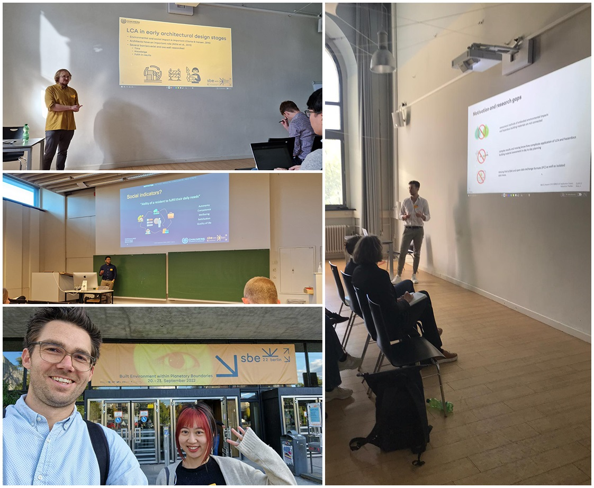

The Research group Sustainable building was well represented at the Sustainable Built Environment (SBE) Conference in Berlin from September 20thto 23rdwith four researchers. The conference with the theme “Built Environment within Planetary Boundaries” had a strong focus on technical sessions such as Life Cycle Assessment and Circularity but included also topics such as Urban Governance.Toivo Säwen presented a paper on a “Tool characterisation framework for parametric building LCA”. First, a framework for classification and characterisation of tools based on workflow, adaptability, and required user knowledge was developed. Second, a tool inventory was performed, identifying 13 parametric LCA plug-ins for GH. Finally, four of these plug-ins were further investigated using the developed evaluation framework, a user persona approach, and a simplified test case.The paper evolved form a Master thesis by Emil Magnusson and can be accessed here: 

[Link to article](https://iopscience.iop.org/article/10.1088/1755-1315/1078/1/012090)

Sanjay Somanath presented his work on “Evaluating Social Consequences of Carbon Targets using Trip Completion Rates”. This paper presents the Trip Completion Rate (TCR) as an indicator currently under development to evaluate the social consequences of climate change policies such as Personal Carbon Allowances (PCA). The Västra Götaland region of Sweden is taken as a test case to illustrate how the indicator may be used. 

[Link to article](https://iopscience.iop.org/article/10.1088/1755-1315/1078/1/012088)

Xinyue Wang presented her poster “A Pathway to Climate Neutral Buildings: Definitions, Policy and Stakeholder Understanding in Sweden and China”. She carried out a literature review on the term ‘climate neutral buildings’ andrelated definitionsand interviewed stakeholders in both countries. Shefindsthat Sweden and China are in different stages of development towards climate neutral buildings.butshare similar issues regarding the future development.

[Link to article](https://iopscience.iop.org/article/10.1088/1755-1315/1078/1/012122)

Alexander Hollberg participated in a special forum -the final event of IEA EBC Annex 72, which he had been part of over the last five years.Furthermore, he contributed to the papers of [Sebastian Theißen](https://iopscience.iop.org/article/10.1088/1755-1315/1078/1/012101and) [Roberta di Bari](https://iopscience.iop.org/article/10.1088/1755-1315/1078/1/012092)

We would like to thank the conference organisers very much and look forward to the next conferences in the series! : 

   
<strong> Read more </strong>

[Further information on the SBE series](http://www.sbe-series.org/)  

[DTCC - Digital Twins for Circularity](https://dtcc.chalmers.se/digital-twins-for-circularity/)  

