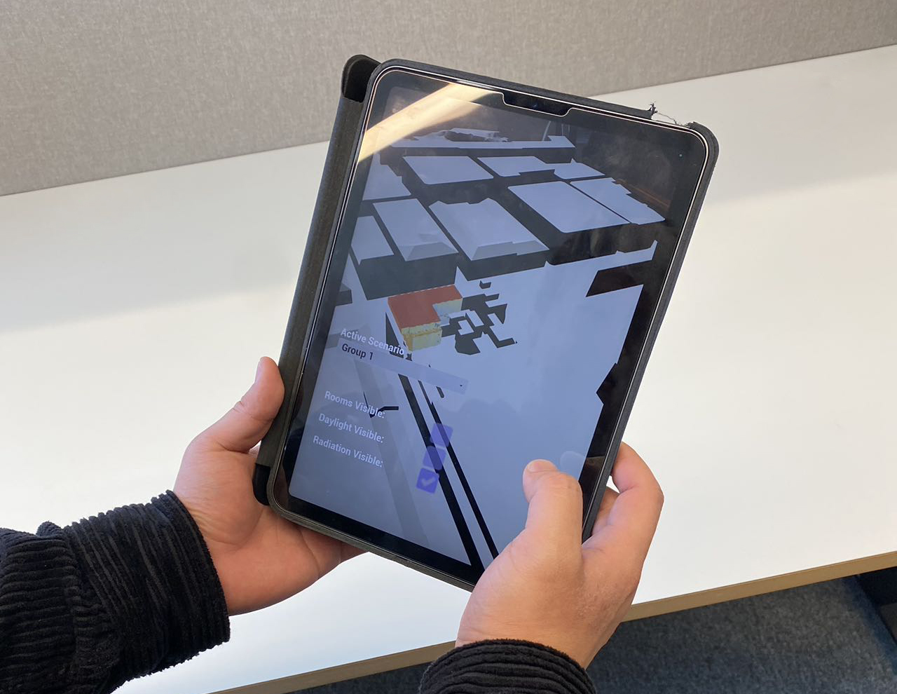

Gothenburg, March 15th.

On March 15th, an Augmented Reality (AR) tool workshop was held after the final critique of ACE405—Design and Performance Optimization in Architecture.

This workshop is based on the collaboration between this course and DTCC to explore AR tools with building performance optimization. The students' building design and simulation outputs were demonstrated on an experimental AR app developed by DTCC. During the workshop, students were encouraged to experience their design with the app and interact with others. In the end, a survey about AR and VR applications in AEC industry was conducted for research and education in the future.