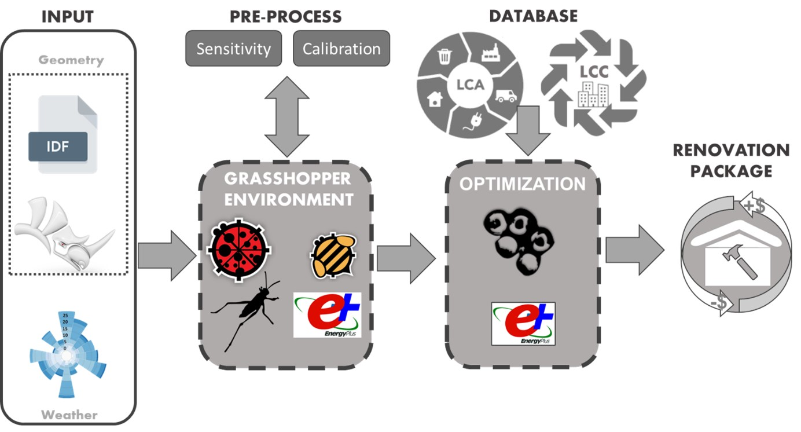

In May the results of the DecarbonAIte project were published on the European Commission's BUILD UP website. The article shows the case study developed in Uddevalla where different renovation solutions in a residential building from the 80s were analysed. The project uses parametric simulations developed with Artificial Intelligence to support decision making in the renovation of sustainable buildings taking into account energy efficiency, life-cycle greenhouse gas emissions and life-cycle costs.
   
<strong> Read more </strong>

[See the EU BUILD UP website](https://build-up.ec.europa.eu/en/resources-and-tools/articles/technical-article-decarbonaite-advancing-sustainable-building)\
[See the linkedIn post](https://www.linkedin.com/posts/eu_build-up_euabrbuildup-technology-skills-activity-6991708572044660736-GE21?utm_source=share&utm_medium=member_desktop)\
[See EU BUILD UP on linkedin](https://www.linkedin.com/company/eu_build-up/?originalSubdomain=be)