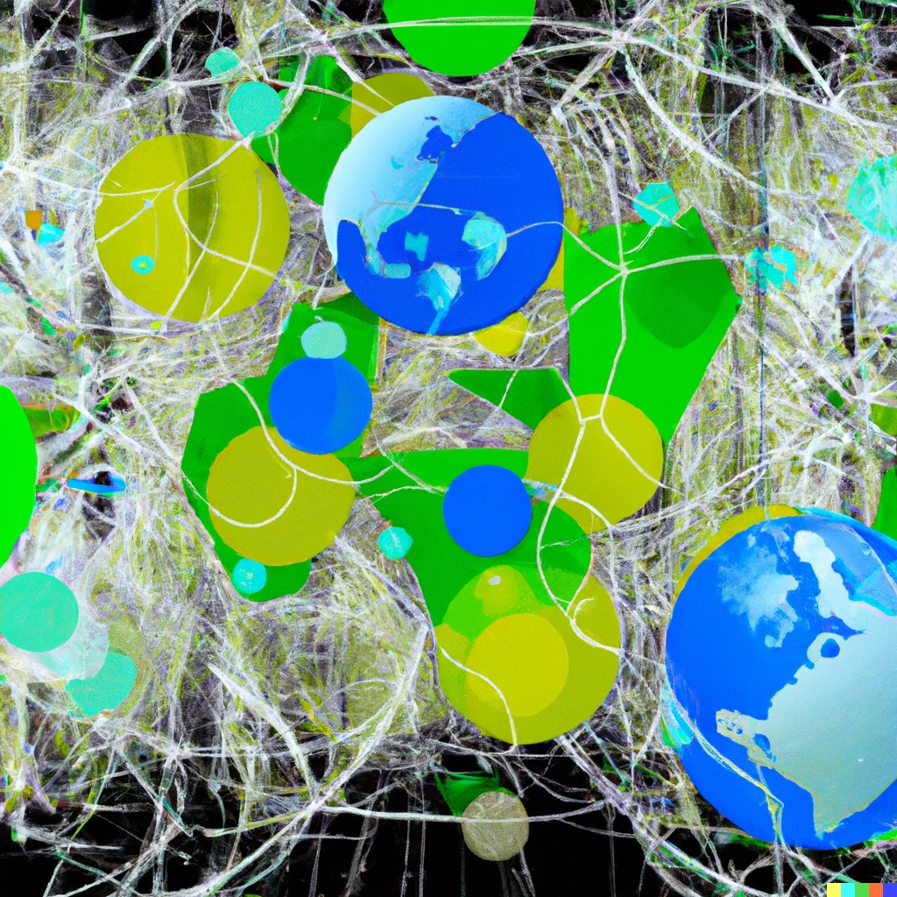

On Thursday, October 6th, Alexander Hollberg gave his presentation for “oavlönad docent”. This is the highest educational degree that can be archived in the Swedish system. His presentation computational sustainable design focused on three questions: 

1) What is computational sustainable design? 
2) Why is it needed? 
3) How it can be used to support the transition towards a sustainable built environment? 

These questions where based on recent research projects as examples. 

   
<strong> Read more </strong>

[Video link to the talk](https://youtu.be/T0653zmH_78)  

