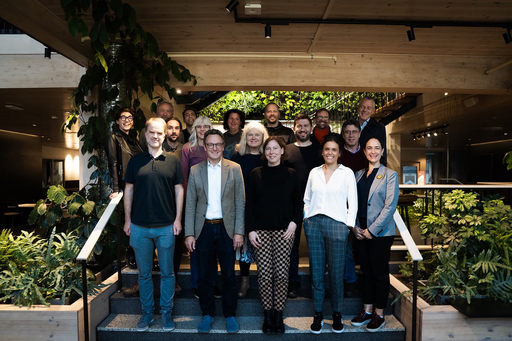

The Digital Twins for Positive Energy Districts (DT4PEDs) international team had its first in-person meeting in Gothenburg on the 5th and 6th of October. Organized by the Swedish team, the workshop’s main focus was the collaborative development of Quality Assurance requirements, pertinent to both the Positive Energy Districts (PED) and its accompanying Digital Twin.

A substantial portion of the workshop, spanning two hours, was dedicated to a co-ideation session. During this engaging session, all team members had the opportunity to bring their unique insights to the forefront, mainly focusing on prioritizing various PED requirements throughout the different stages of property development. This inclusive approach fostered a conducive environment for reflective discussion, allowing mixed teams to thoughtfully consider and evaluate the essential priorities for the Digital Twin, determining what should be included or excluded, and the rationale behind these choices

The result of this participatory workshop will be analised and synthesised into a conference paper for WSBE 2024. 

This Digital Twin Quality Assurance framework will be tested and analysed in 3 different living labs in each country:

**Am Kempelenpark, Vienna, Austria**
A new, diverse urban quarter is being created at "Kempelenpark" in Vienna. Around 1,100 rental flats will be created in what has been a purely commercial location up to now. 

**Jättesten, Gothenburg, Sweden**
The district consists of mainly residential buildings constructed in the 1950s and a school for 500 school kids (pre-school and 1st - 9th grade, 6 – 16 years) constructed in 1957. The PED-Living Lab includes both retrofitting of the existing buildings and densification by adding 3 buildings. 

**Camili, Sakarya, Turkey**
The Camili District is a new settlement established after the 1999 earthquake. Huge green parks, hospitals, new residential buildings, schools, shopping malls, mosques, university buildings, bike valley and huge bike paths, highways and governor’s office are located here. In the scope of this project, it’s planned to figure out a positive energy district by implementing Digital Twin tools.

**Read more**

[Digital Twin for Positive Energy Districts](https://www.johannebergsciencepark.com/en/projects/digital-twin-positive-energy-districts#:~:text=The%20DigitalTwins4PEDs%20project%20wants%20to,balance%20in%20the%20entire%20process.)