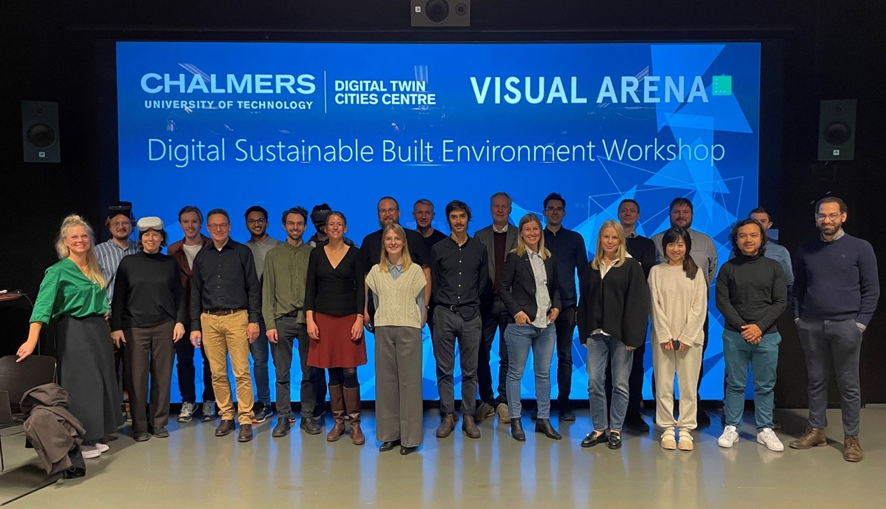

A successful launch of a new course format for professional education by the DTCC in collaboration with the Department of Architecture and Civil Engineering at Chalmers.

In November 2021, the first DTCC professional education course on Digital Sustainable Built Environment hosted 50 participants representing a wide range of stakeholders from architects, urban planners, engineers, to software developers, researchers, and consultants. On three Fridays, the participants had the chance to listen to lectures by international experts in the morning and then explore new digital tools hands-on in workshops and discuss the potential and challenges of digitalisation in their field in the afternoon.

[Read more](https://dtcc.chalmers.se/first-dtcc-3-day-professional-education-course-digital-sustainable-built-environment-launched/)
