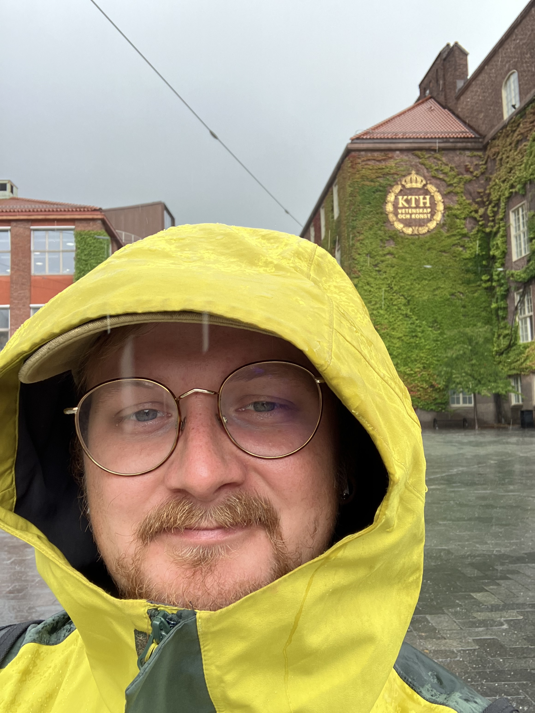

We sat down with Toivo to speak about his recent research visit at SEED, KTH. His work focuses on bridging the gap between building-level LCA approaches and the strategic environmental work needed at the city and regional levels. In this interview, Toivo shares what inspired his visit, key insights from collaborating with experts in environmental issues, and the challenges he encountered along the way.

**What inspired you to pursue a research visit at SEED, KTH, and how does it complement your work at Chalmers?**

> I became acquainted with researchers at KTH through annual PhD forums organized by professors in the LCA field. The KTH research group has considerable experience supporting governmental bodies working on environmental issues and has a specific focus on renovation instead of new construction—a focus I felt was missing in my previous research.

**What key insights did you gain from your collaboration with the SEED, KTH team?**

> A key reflection is that while LCA approaches can be beneficial at the building level and climate budgets are useful on a global/national level, the missing link is in between—to support cities and regions in their strategic environmental work. What kind of tools are needed?

**How has your experience influenced your perspective on sustainable built environments, particularly regarding renovation projects?**

> I have learned that renovation projects are very challenging and socially entangled, requiring a much more project-specific approach to be successful than new construction.

**Were there any unexpected challenges during your visit, and how did you overcome them?**

> My initial plan was to finalize a research paper during the visit; however, progress was slow because I didn’t feel I had the theoretical knowledge to fully support the work. I overcame this by spending a lot of time in the excellent KTH library and ensuring I had a comprehensive overview of the literature instead of rushing to complete the paper.

**What aspects of the research culture at SEED, KTH would you like to integrate into your work at Chalmers?**

> All staff—from research assistants to professors—participated in informal events to exchange ideas and get to know each other better, fostering very good social networks and a strong, positive culture.
