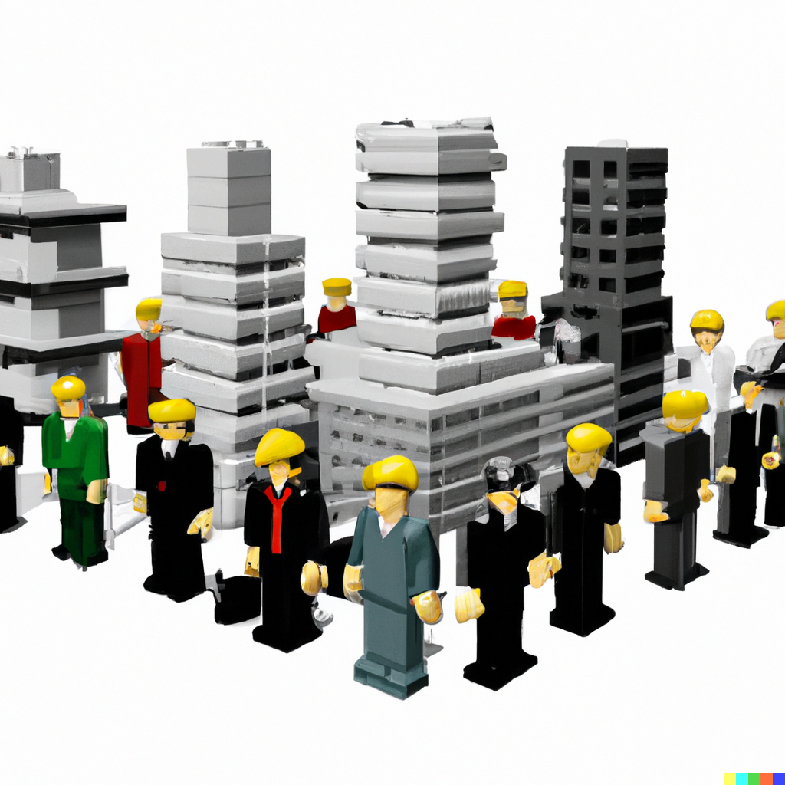

We recently caught up with Xinyue about her research visit at the University of Washington. During her stay, she explored innovative machine learning methods to enhance building sustainability—not only in terms of energy efficiency but also in indoor air quality and urban energy dynamics. In this interview, Xinyue discusses her motivation for the visit, insights from international collaboration, and plans to integrate new ideas into her ongoing research at Chalmers.

**What motivated you to pursue a research visit at the University of Washington, and how does this experience align with your work at Chalmers?**

> Being able to collaborate and network internationally is something I’ve always wanted to do during my PhD. Moreover, during my licentiate, I had many questions regarding my research—specifically, whether the methods are still valid outside of the Swedish context. Therefore, it will be nice to have a chance to figure it out.

**What key insights or discoveries did you gain from collaborating with researchers at the University of Washington?**

> I learned more about using machine learning methods to improve building sustainability at different levels—not only for single-building energy, but also for indoor air quality and urban energy.

**How has this experience influenced your approach to your ongoing projects in sustainable built environments?**

> I presented my research to the entire research group and received valuable feedback on hyperparameter selection and dataset development for my model. I would like to integrate these suggestions into my research.

**Did you encounter any unexpected challenges during your visit, and how did you manage them?**

> Obtaining my visa turned out to be more challenging than I anticipated. The entire process takes around two months, which shortened my research visit.

**What aspect of the University of Washington’s research culture would you like to incorporate into your work at Chalmers?**

> They hold an end-of-quarter seminar in which everyone presents their work from throughout the semester, allowing for the exchange of ideas. I think that could be a nice practice to adopt.
