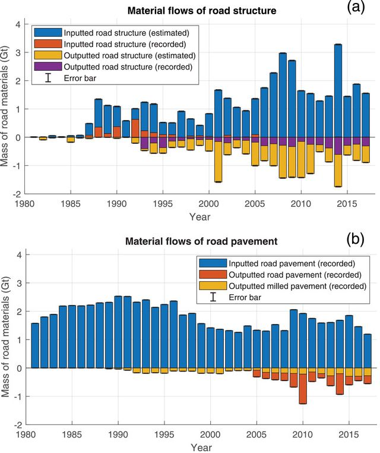

The Journal of Industrial Ecology shared the article "Machine learning-based stocks and flows modeling of road infrastructure" by [Babak Ebrahimi](https://orcid.org/0000-0002-3086-0816), [Leonardo Rosado]() and Holger Wallbaum.
The paper introduces a new method using machine learning applied to material flow analysis as an alternative to achetype modeling to study road infrastructure.
[Holger Wallbaum](https://sb.chalmers.se/author/holger-wallbaum/) says this was the first attempt to apply machine learning based methods to MFA but is confident in developing this method further with SB's newest colleague, [Maud Lanau](https://sb.chalmers.se/author/maud-lanau/) .
   
<strong> Read more </strong>
 
[Link to research paper](https://doi.org/10.1111/jiec.13232)  
[Link to Post](https://www.linkedin.com/comm/feed/update/urn%3Ali%3Aactivity%3A6983098260374663168?midToken=AQHuUKW6n0jZzA&midSig=3Y6ksfeig2qas1&trk=eml-email_notification_single_mentioned_you_in_this_01-notifications-1-hero%7Ecard%7Efeed&trkEmail=eml-email_notification_single_mentioned_you_in_this_01-notifications-1-hero%7Ecard%7Efeed-null-eh7jy%7El8uf8bev%7Esx-null-voyagerOffline&lipi=urn%3Ali%3Apage%3Aemail_email_notification_single_mentioned_you_in_this_01%3BCg2WOIvGTBKjll%2BYdDvJUQ%3D%3D)  

