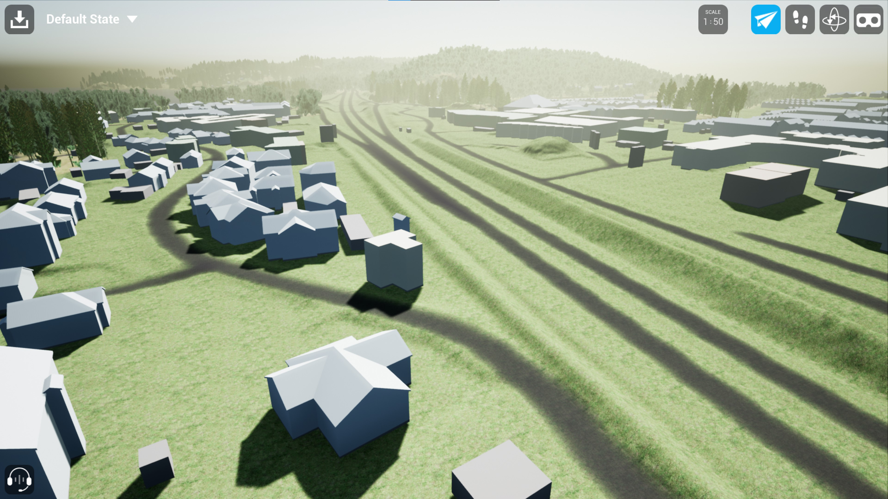

The twinable project was featured on xyHt magazine in an article titled "Interactive urban planning" by Marc M. Delgado. Marc interviewed members of the Twinable team, Alexander Hollberg, Liane Thuvander and Sanjay Somanath on the process of developing the interactive VR application within the Twinable project. 
Marc Delgado, PhD, is a GIS specialist who crisscrosses continents teaching GIS in Asia, Europe, South America, and Africa.

**Read more**

Print version of the article : [xyHt](https://issuu.com/diversionspub/docs/xyht_1023_issupdf/12)