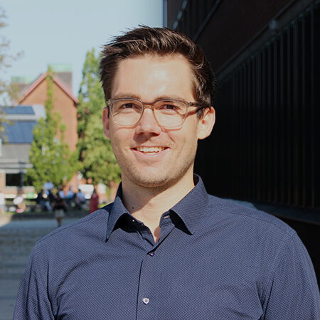
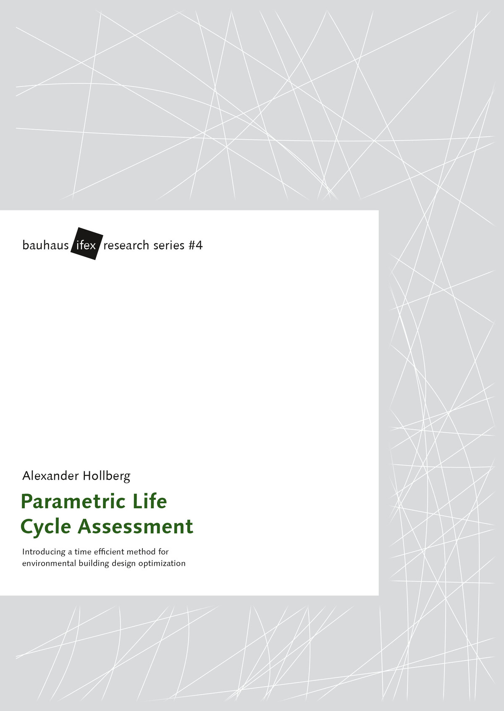
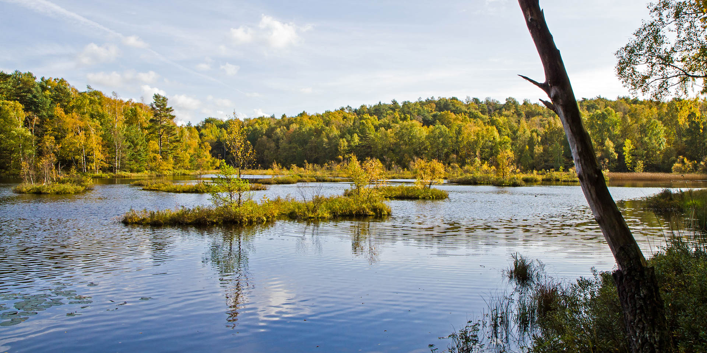

This week we sat down with **Alexander Hollberg**, the Research Area Leader for Sustainable Built Environments, to discuss his current projects, research achievements, and insights for early-career researchers. From leading projects in the Computational Design theme, Alexander shares his thoughts on how digital methods are shaping the future of sustainable architecture and urban planning.

**Could you tell us about the different projects you are currently leading or involved in within Sustainable Built Environments?**

> I lead several projects in the Computational Design theme of our research area. Overall, we are interested in how digital methods can support design and decision-making for a sustainable built environment. Different projects look at different approaches to answering this question, ranging from augmented and virtual reality to multi-domain simulations using digital twins. I am also acting as research area leader.

**Looking back, what are some key achievements or milestones from your research that you're most proud of?**

> That is a difficult question. I am still proud of my [PhD thesis](https://www.db-thueringen.de/receive/dbt_mods_00037445) that I thought nobody would ever read but that seemed to have inspired others to use LCA for building optimization in early design stages. I am also proud of our collaboration with Universeum, where we provide different data visualizations—not because of the research itself, but because it attracts lots of interest from citizens visiting the exposition.

*A parametric method for building design optimization based on Life Cycle Assessment*

**How do your projects contribute to addressing global challenges in sustainability and the built environment?**

> Our projects mainly focus on environmental aspects by aiming to lower resource consumption and environmental impacts from the construction and operation of buildings. We also have a few projects that take social and economic aspects into account.

**What advice do you have for early-career researchers looking to make a meaningful impact in this field?**

> Follow your interests, be creative in how you address challenges, be open to criticism, and share your research results with the world.

**When you're not working on research, how do you like to spend your time or unwind?**

> Work and my kids already occupy 26 hours a day, but if I have the chance, I go for a run in [Ängårdsbergen](https://www.goteborg.com/platser/anggardsbergens-naturreservat). I always feel refreshed and more creative afterward. I also like bouldering and, in the summer, wingfoiling because I can completely detach from work.

*Änggårdsbergens Naturreservat 2011 | Photo: Bolstermage (CC BY-SA 3.0)*

We thank Alexander for sharing his insights and experiences with us. His contributions to sustainable design and computational methods continue to inspire researchers and practitioners alike. We look forward to following his ongoing and future projects!

   
<strong> Read more </strong>
- [Read more on Chalmers Research](https://research.chalmers.se/en/person/hollberg).
