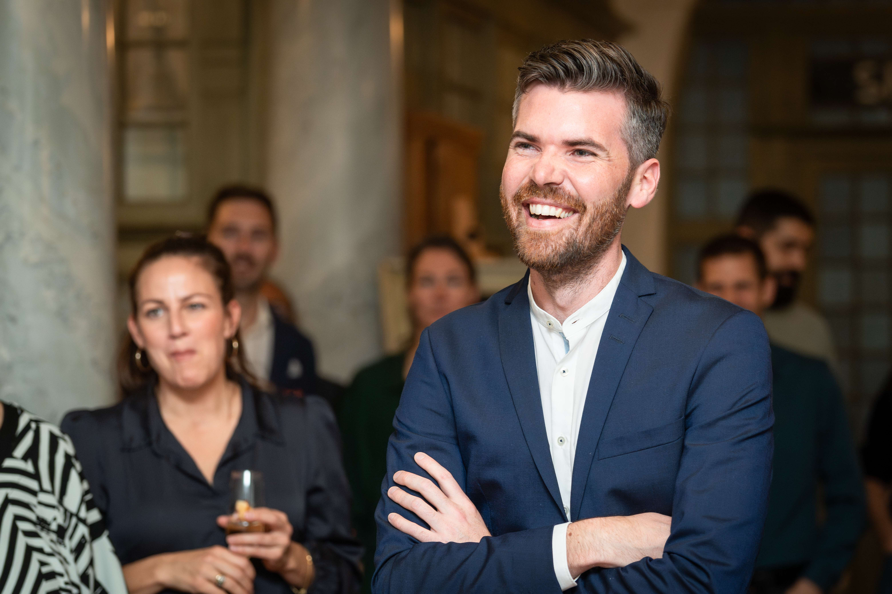
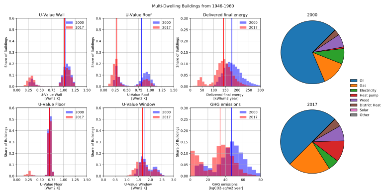
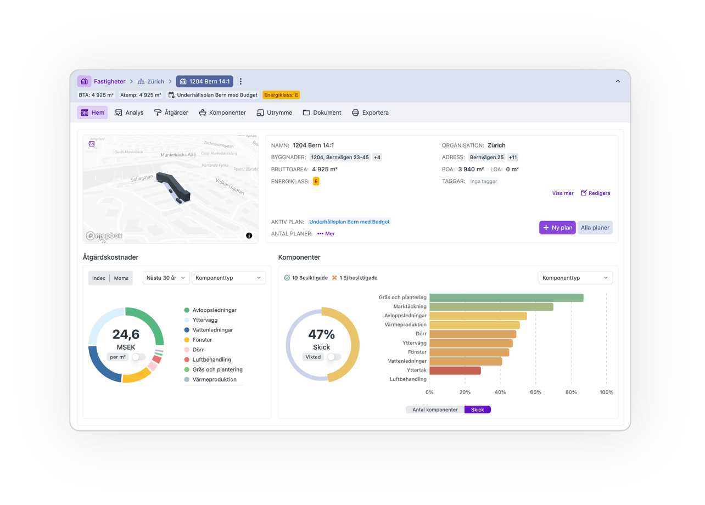

This week, we talk with **Claudio**, an alumnus of the Sustainable Built Environments research area at Chalmers University, whose PhD and postdoc work on building stock modeling (BSM) laid the foundation for his current venture, SINOM. Claudio shares how his research at Chalmers on dynamic BSMs supports strategic energy planning and decarbonization, how that experience shaped his career path, and what he’s building today to help the real estate sector digitalize and decarbonize.

**What was the focus of your research during your time at Chalmers University?**

> During my time at Chalmers University, my research focused on advancing building stock modeling (BSM) to support strategic energy planning and decarbonization. My work aimed to unlock the sector's potential for emissions reduction by developing more accurate, dynamic models. 

*Illustration from Claudio's research comparing the synthetic building stock with real data. [Nägeli et al. (2020) ](https://doi.org/10.1016/j.enbuild.2020.109763)*

> I addressed key limitations in existing BSMs by introducing synthetic building stocks to better characterize national building stocks and applying agent-based modeling to simulate stock dynamics influenced by economic and policy factors. Additionally, I extended the application of BSMs to support long-term renovation and maintenance planning for large property portfolios, bridging the gap between academic modeling and practical decision-making in real estate and urban energy policy.

**How has your experience in Sustainable Built Environments influenced your current career path?**

> A lot! During my time at Chalmers, I met my co-founder Amir, and the work we both did during our respective PhD and postdoc projects laid the foundation for starting **SINOM** with the aim to help digitize and decarbonize the real estate sector by turning cutting-edge academic insights into practical, scalable tools for property owners and stakeholders.

**What does SINOM do?**

> SINOM provides a smart, data-driven planning platform for sustainable property maintenance. By combining component-level condition data, predictive algorithms, and energy and climate impact analysis, SINOM helps property owners create optimized maintenance plans that reduce costs, extend building lifespan, and support planning toward energy and climate goals. The platform enables informed decisions through powerful visualizations and data-driven insights tailored to both strategic and operational needs.

SINOM platform dashboard illustration. Source: [SINOM](www.sinom.se).

**And what does the name mean?**

> It comes from the Swedish idiom **“i sinom tid”**, meaning “in due time.”

**What is a memorable moment in your journey with SINOM?**

> It’s not a single moment, but rather the experience of seeing our vision come to life over the past years that stands out as the most rewarding part of my journey with SINOM. Watching how an initial idea has grown into a real platform used by major organizations is incredibly fulfilling.

**What is the biggest challenge (practical or societal) with what you are trying to achieve with SINOM?**

> One of the biggest challenges with what we’re trying to achieve with SINOM is not the technology itself, but the organizational change required to fully adopt and benefit from it. The real barrier in the digital transformation of the property sector often lies in change management—aligning people, processes, and culture with new digital tools. Many property organizations still work in silos with Excel-based routines or fragmented systems, and shifting to a data-driven, predictive approach like SINOM’s requires cross-functional collaboration and a willingness to rethink traditional workflows. Without long-term commitment to change, even the best tools risk being underutilized. Bridging this gap between technical potential and operational readiness is one of our most important—and ongoing—challenges.

**Do you have any advice for students and researchers aiming to make an impact in sustainable development?**
> With the risk of sounding overly cheesy by quoting Gandhi—**“Be the change you want to see in the world.”** What I want to say with this is: go out there and work towards your values, whether that’s in a startup, an NGO, or continuing in academia. As researchers in sustainability, we often stop at describing the problems or even outlining solutions—but that’s only ever the first step. The real challenge lies in implementation. If we want to make a tangible impact, we need to engage beyond the research. When it comes to the climate crisis, it’s five to twelve—we need to accelerate the transition, and that means being part of the solution, not just an observer.

**What’s one thing you miss about your time at Chalmers?**

> (too) long coffee breaks in the lunch room with my colleagues!

A big thank you to Claudio for sharing his journey from Chalmers research to founding SINOM. We look forward to seeing how his work continues to drive decarbonization and digital transformation in the built environment.

---

   
<strong>Read more</strong>   

[Learn about SINOM](https://sinom.se)  
