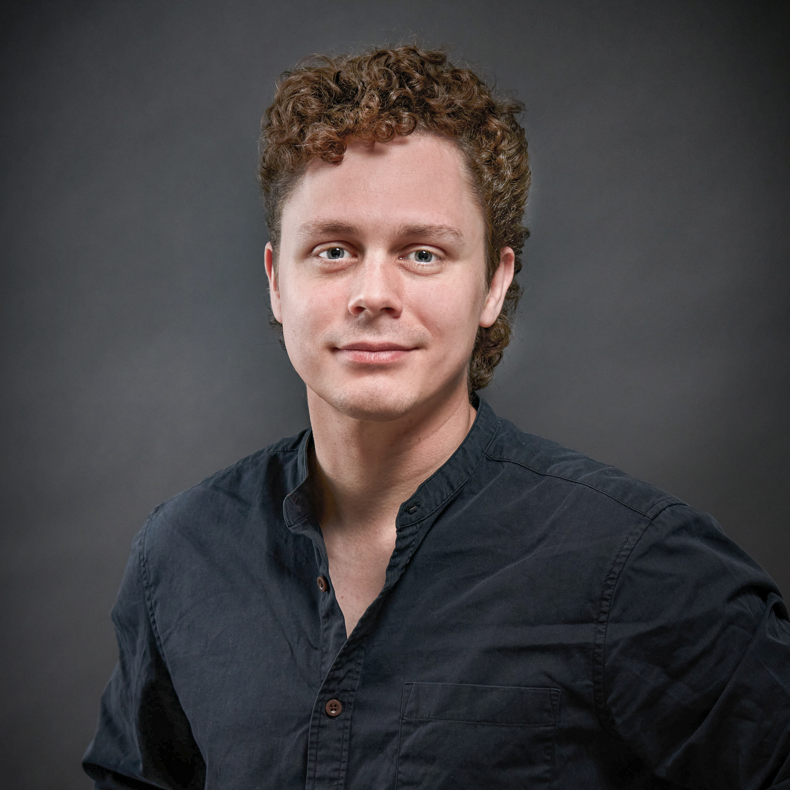

As his one-year position as project assistant comes to a close, we caught up with **David Sindelar** to reflect on his time within the Sustainable Built Environments (SBE) research area. From working on international projects to exploring circularity in building design, David shares his experiences, challenges, and ideas for what lies ahead.

**How has your time at SBE been so far? Any reflections or standout memories?**  
> My one year as a project assistant here at SBE has been an incredible time! I’ve had the oppurtunity to meet amazing new colleagues, now friends, and I am sad to see this chapter come to an end so soon. I have truly enjoyed our morning coffee rituals, engaging lunch discussions and the many after-work excursions.

**You started off working primarily with the CREATE project. What were some of the highlights of that experience for you?**  
> A personal highlight for me was to be part of such an extensive and international project, covering a variety of topics within the theme of circular economy and sustainable building practices, an experience that was not just inspiring but also eye-opening.

  
*David with the CREATE team at the final project meeting.*

**What was the most challenging part of the project?**  
> Covering such a vast array of research areas, from stock modelling to governance policy to life cycle assessment, it was at times challenging to understand how each part informed the other. However, in the end it was impressive to see how naturally these research areas complemented and enriched each other.

**Beyond CREATE, you’ve been part of several other projects and collaborations during your time here. Could you tell us a bit about those?**  
> Apart from the CREATE project, I worked on developing building archetypes for material stock modelling and supported the work in both the Ecom4Future and DT4PED projects where I helped create material databases for different energy and renovation scenarios.

**What new skills or ways of thinking have you developed at SBE?**  
> For sure! My understanding of reuse potential of buildings at an urban scale has greatly increased during my time in the CREATE project, along with my analytical skills within research, having gathered data from various sources and looking at how they can inform larger and more complex questions regarding circularity.

**You were originally trained as an architect. Did that background give you a different perspective in your work?**  
> Definitely, especially in my work with other PhD students developing archetypes for both residential and non-residential buildings where knowledge of building trends in Sweden as well as having an understanding of different building structures came in good use.

  
*Sharing insights at a recent lunch talk.*

**Are there any topics or questions from your time here that you want to explore further in the future?**  
> Yes, the topic of reuse within architectural practice is something that I would very much like to learn more about in my future work, especially in a more zoomed-in context, focusing on how to practically implement it through innovative designs.

**Looking ahead, what kinds of roles or opportunities are you hoping to explore after SBE?**  
> While I’m aiming for a role as a practicing architect, my experience collaborating with PhD students in SBE and engaging with their research has made me very interested in pursuing a future in research within the field of architecture as well.

**Any final words of advice for current or future members of the SBE research area?**  
> For current members of the SBE research area I would simply like to thank them for creating such a warm and welcoming environment, it truly has been a great time working together. And for future members, I can say with confidence that they have a great team of researchers and colleagues to look forward working with.

  
*A sunny fika with the team during the Jonsered outing.*

---

We thank David for his contributions to the SBE research area and wish him all the best in his next steps—whether in practice, research, or a creative combination of both!

    
**Further reading**  
- [Learn more about the CREATE project](https://www.sb.chalmers.se/project/create/)
