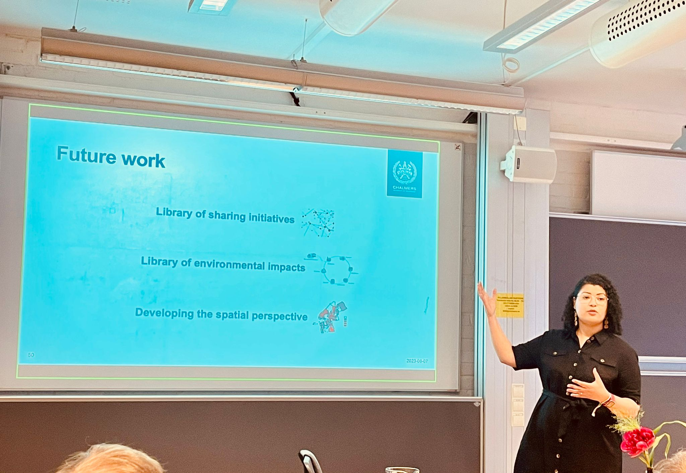

This week we sat down with **Divia Jimenez Encarnacion** to discuss her PhD journey, research on the sharing economy, and advice for future researchers. Divia shares her insights on sustainability, urban consumption, and the challenges and rewards of academic life.

**Congratulations on your PhD! Could you briefly tell us what your research was about, in your own words?**

> My research focused on exploring the environmental sustainability potential of sharing household products. Sharing activities (for example, renting, exchanging, and buying second-hand tools, clothes, etc.) are often seen as inherently sustainable. However, in reality, many different factors need to align for sharing to achieve sustainable outcomes. Through my work, I elucidated these factors and studied how some of them manifested in the context of Gothenburg.

**What inspired you to study sharing household products and their role in sustainability?**

> The topic of sustainability in the household has always been close to my heart. When considering climate change and other environmental issues, the picture can sometimes be bleak. While many different actors must address these issues, I also believe in empowering individuals to act within their sphere of influence. In some cases, this might be as simple as loaning a drill from your neighbor rather than buying a new one. Through research, we can identify which of these “simple” actions has the greatest potential to be helpful.

**From your research, what are the most surprising or important insights you discovered about the sharing economy in cities?**

> My research revealed that the sustainability potential of sharing is not limited to the action itself, but is also influenced by purchasing patterns before and after sharing. For instance, if you save money by sharing and use it to buy high-impact products and services, then the environmental benefits of sharing are reduced. The same applies to travel behavior – driving long distances or frequently to retrieve shared products can offset sustainability benefits.
>
> When studying these purchasing and traveling aspects at a city level, a quite complex picture emerges. In Gothenburg, women, younger individuals, and highly educated individuals may be more willing to reduce their purchases and share instead. However, if they are located, for example, in the city outskirts, they have fewer opportunities to access them using low-impact transportation modes. This also depends on the product in question. For instance, clothes are often bought in large quantities but are less attractive for sharing, whereas the opposite is true for tools and hobby items.

**Your work combined surveys, statistical analysis, spatial methods, and collaboration with the city of Gothenburg. What was it like working across so many methods and with local government?**

> The variety of methods in my research allowed me to consider the sharing economy from important angles – namely, the user perspective, the geospatial perspective, and the governance perspective. Applying these methods kept my researcher´s curiosity alive and led me to collaborate with very talented people within each. Particularly, working with local government representatives helped make my research relevant for the city´s needs.

**How can your findings be useful for households, local governments, or companies interested in sharing initiatives?**

> For households, my research highlights that sharing only makes sense if it changes key habits, such as buying less or choosing nearby sharing options instead of driving long distances. For local governments, the findings show where interest in sharing is high, but access is limited, which can inform investments in infrastructure and planning. For companies or initiatives, understanding user behavior is key: the most successful models will be those that make sharing convenient while also supporting sustainable behaviors. My thesis also provides a catalogue of recommendations for each of these actors, focusing on specific demographic, geospatial, and product groups. Feel free to ask for a copy!

**In your view, what role can sharing play in making cities more sustainable — and where are the limits?**

> Sharing, when done correctly, can be an important facilitator for reducing raw material use, emissions, and other environmental impacts; especially for high-income groups whose material needs are largely met. At the same time, it´s important to see sharing as one of many options. For groups that are unable to share, there are many other ways to contribute to sustainability, including travelling more sustainably, reducing energy use in the household, and avoiding food waste.

**What was the biggest challenge you faced during your PhD, and how did you overcome it?**

> A PhD program involves many different activities, from teaching and supervising to producing and communicating research. So, time management definitely became a challenge for me! I addressed this by trying out as many efficiency tricks as possible until I found a good combination. Some resources I found helpful were “Finish on time” by Åsa Burman and “Managing your mental health during your PhD” by Zoë J. Ayres.

**Now that you’ve finished your PhD, what directions are you most excited to explore in your future career?**

> I am motivated to continue supporting sustainable consumption lifestyles. My work has often departed from the user experience, so I am now curious to explore how other actors (for example, sharing initiatives) interact with the household´s actions.

**What advice would you give to future students or PhD candidates who want to work on sustainability and urban consumption?**

> I believe it’s essential to keep a balance between personal values and love for the craft. Many start their studies because they want to make a difference, and that is very important! But if your research shows that there is still a long way to go in terms of sustainability, you can focus on your passion for generating knowledge rather than becoming discouraged. Sometimes motivation comes from honoring the process instead of the results.

**Outside of research, what helps you recharge and stay inspired?**

> Nature, the gym, and baking bread! I find it magical to watch things grow, whether it´s trees, muscles, or dough.

We thank Divia for sharing her experiences and insights. Her dedication to sustainability and innovation continues to inspire the next generation of researchers. We look forward to seeing her future contributions to the field!

   
<strong> Read more </strong>
- [Read more about Divia on Chalmers Research](https://research.chalmers.se/en/person/divia-jimenez-encarnacion).
