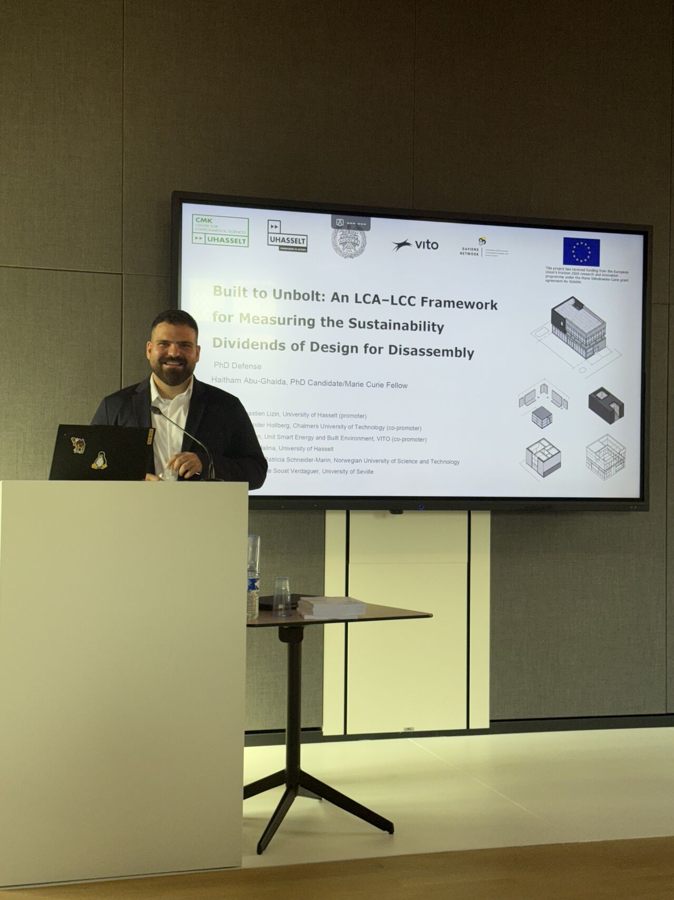

This week we sat down with **Haitham Abu Ghaida** to talk about his research journey, key insights, and advice for students interested in sustainability and the built environment.

**Could you briefly tell us what your recent work is about, in your own words?**

> Built to Unbolt develops a way to fairly measure the environmental and economic benefits of design for disassembly (DfD). It does three things in one framework: (i) models the interdependencies between building components so we don’t miss collateral “cascade” impacts, (ii) switches to a time-resolved prospective LCA so future replacements are assessed with future (cleaner) background data, and (iii) adds a time-resolved, value-added LCC so costs are handled consistently with the LCA, including inflation and discounting. In whole-building tests, ignoring dependencies can hide ~30% of embodied impacts, high-disassembly variants consistently cut embodied GHG vs. business-as-usual, and the clearest economic gains come from avoiding near-term replacement cascades—not from far-future salvage credits.

**What inspired you to study this topic, and why it matters?**

> I came to design for disassembly from a “right-to-repair” mindset. I’ve always fixed phones and laptops, upgraded old machines, and hacked together Raspberry Pi/Arduino projects and DIY servers from retired hardware. That hands-on world teaches you the value of modularity and access: if you can open it, you can maintain it, upgrade it, or reuse it. Buildings aren’t so different. DfD applies the same logic at architectural scale—designing layers, connections, and interfaces so components can be replaced without collateral damage and materials can circulate at high value. That’s why it matters for sustainability: it turns buildings from future waste into long-lived, serviceable systems and material banks.

**What are the most surprising or important insights from your research?**

> Dependencies matter. Traditional LCAs underestimate embodied GHG by up to ~28% when they ignore component interdependencies and the cascading removals they trigger. In the same studies, high-disassembly variants achieved up to ~46% lower embodied GHG than low-disassembly ones.
>
> Time matters. Switching from static to time-resolved prospective LCA shows static LCA can overestimate embodied GHG by up to ~32% (it freezes today’s background data while supply chains decarbonize). Yet the ranking holds: high-disassembly designs still win across scenarios.
>
> Economics, aligned with LCA. The time-resolved value-added LCC reveals where savings really come from: preventing secondary (cascade) replacements, deferring primary replacements beyond the study horizon, and trimming material intensity up-front—not from residual value decades away (discounting shrinks those to near-zero). In a façade case, the disassemblable ventilated panel had the lowest net-present cost and the smallest cascade exposure.



**How does time-resolved (prospective) LCA change our thinking?**

> It corrects two biases of static LCA: (1) inflated replacement burdens (because future manufacturing/energy are cleaner) and (2) exaggerated Module D credits (avoiding future cleaner virgin production yields smaller credits). Despite this, DfD’s advantage persists: in the ZEB case study (BAU vs. HDP vs. LDP), the high-disassembly design reduced embodied GHG ~12–25% versus BAU across SSP1–SSP5 pathways (excluding Module D).

**Your work uses multiple methods and collaborations. What was it like working across disciplines and with partners?**

> The framework integrates LCA, LCC, and design for disassembly logic, and it’s been developed with input from architects, engineers, and researchers in building physics and circular construction. Collaborations enabled access to detailed building models and real maintenance/replacement data, which were crucial to map dependency networks and test whole-building cases.

**How can your findings be useful for households, local governments, or companies?**

> For building clients and designers: prioritize high-disassembly details where dependency cascades are largest (façades, services, interior finishes). Use time-resolved scenarios to stress-test decisions rather than single-point static LCAs.
>
> For local governments and housing providers: support deconstruction pilots and documentation (material passports) to build evidence on recovery without collateral damage; align procurement with disassembly criteria.
>
> For companies: develop products with accessible fasteners and replaceable layers; offer service models that monetize avoided cascade replacements rather than distant salvage value.

**What was the biggest challenge you faced, and how did you overcome it?**

> Balancing methodological depth with decision relevance. I tackled it by prototyping small (component/assembly level), iterating fast to whole-building cases, and co-developing with practitioners so the outputs answered real procurement and design questions.

**What directions are you excited to explore next?**

> Moving to Gothenburg as a postdoc, I’m keen to: 

(i) gather field evidence for disassembly networks in real deconstruction projects, 

(ii) refine spatially/time-resolved inventories to capture regional decarbonization lags, 

(iii) embed risk and option value in time-resolved LCC, and 

(iv) integrate with digital tools—BIM-based extraction/visualization of disassembly networks and material passports.

**What advice would you give to students or PhD candidates in this area?**

> Start with the problem, not the method. Pick a real decision and let that drive methods. Mix methods (LCA, costing, flows) with design research and field observation. Prototype small and iterate fast. Be honest about uncertainty—use scenarios and report ranges. Design for reuse of your work (clean code, clear assumptions, versioned data). Engage practitioners; site visits beat perfect models. Communicate visually—layers, connections, and flows. And take care of yourself: mentors, peers, and pacing matter.

**Outside of research, what helps you recharge?**

> Looking forward to Gothenburg’s archipelago and fika. I’ll miss the UHasselt team, the ease of a compact city, and quiet bike rides in Hasselt.

We thank Haitham for sharing his experience and insights. We look forward to seeing his future contributions to the field.

<strong> Read more </strong>
- [Haitham’s profile](/author/haitham-abu-ghaida/)

<!--
Optional visuals (add images to this folder and update the src path):
- 
- 
- 
- 
Tip: Keep images ~1600–2000px wide, 3:2 or 16:9.
-->
