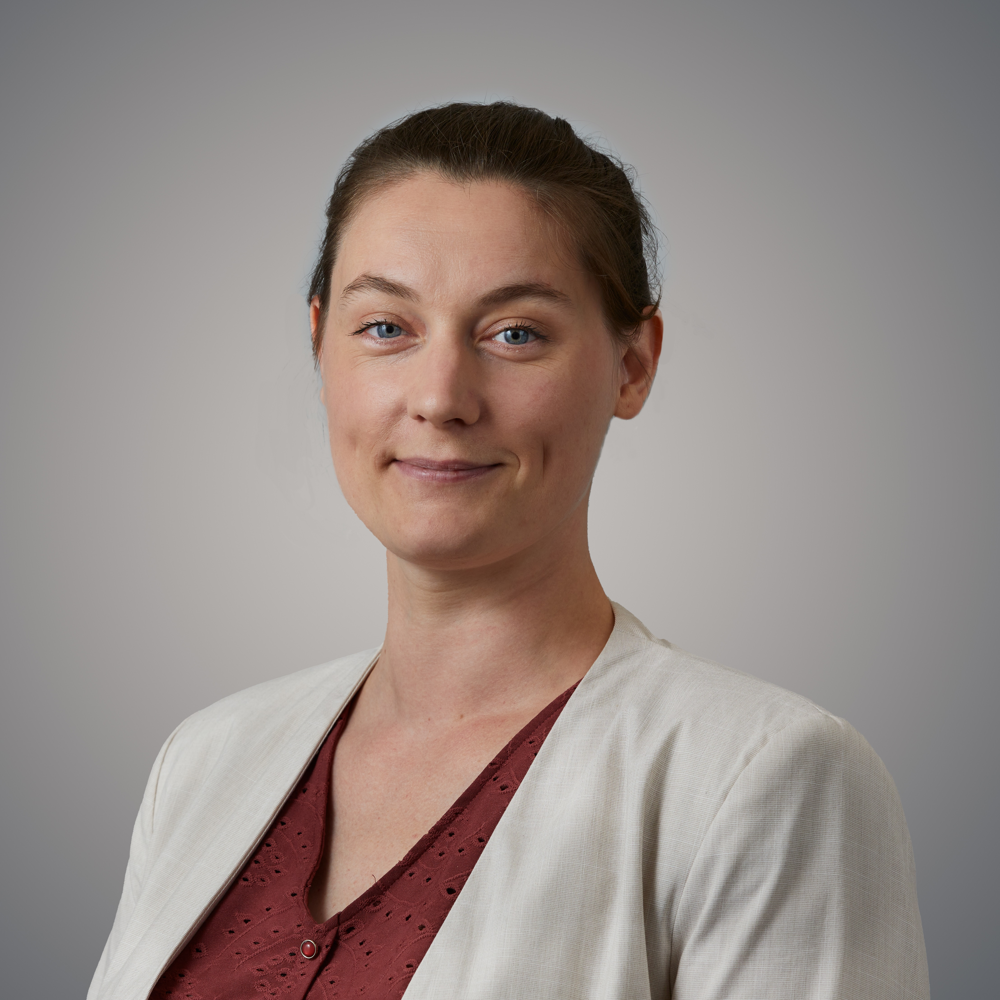
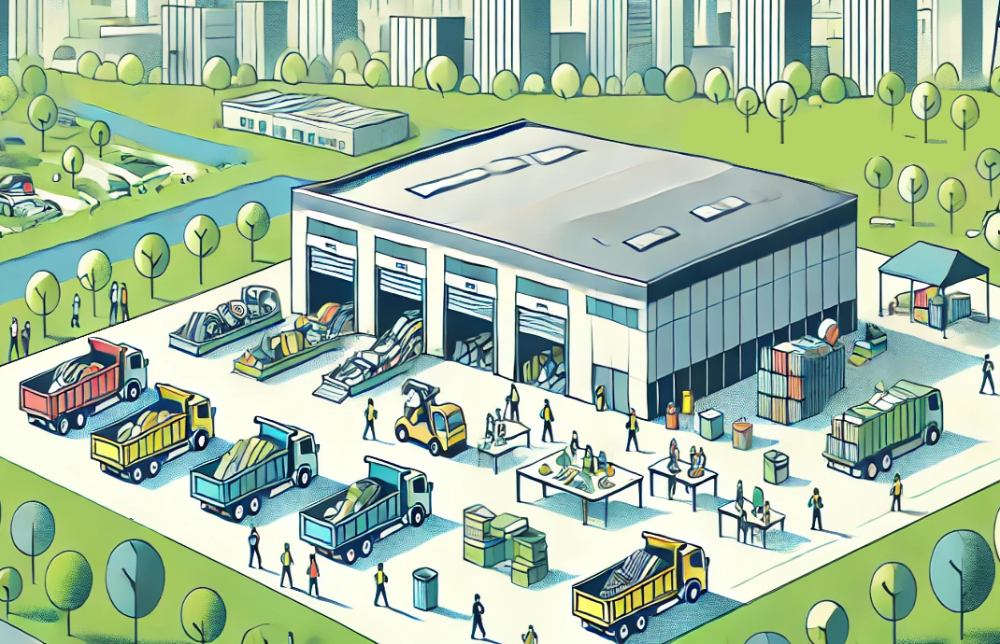
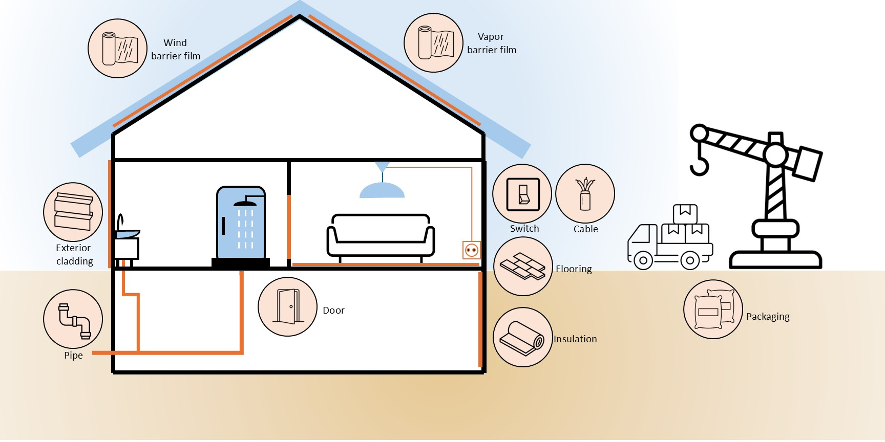
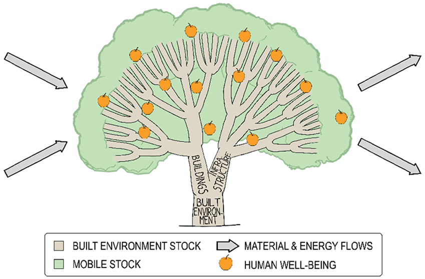
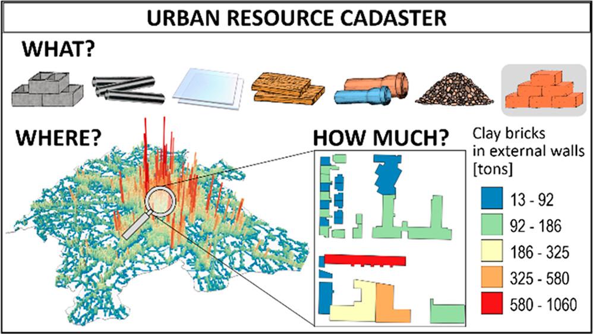

This week, we had the pleasure of speaking with **Maud Lanau**, a fellow SBE researcher whose work is shaping the future of sustainable built environments. Maud’s work at the intersection of industrial ecology and circular economy aims to reduce the environmental impact of buildings and infrastructure by focusing on material stocks, flows, and the life cycle of construction materials. In this conversation, Maud shares insights into her current projects, including her innovative work on material stock modeling and the transition to circular construction practices. She also discusses how her research is addressing global sustainability challenges and gives us a glimpse into her passion for teaching and personal interests outside of academia.

**Thank you for sitting down with us Maud! Can you tell us a bit about your core research focus and what drives your work in the sustainable built environment**

> In my research, I want to understand how to reduce environmental impacts caused by the development of the built environment. I use industrial ecology paradigms to do that, specifically socioeconomic metabolism and circular economy. Those are powerful in capturing the much-needed systems perspective required to address sustainability issues.

> My ‘day-to-day’ research focuses on material stock and flow modeling, as well as the entire research pipeline surrounding it. For example, upstream of the pipeline, I work on identifying and gathering the necessary data for material stock modeling—figuring out what data exists, where to find it, how to obtain it, and evaluating its quality. The core of the pipeline is the modeling itself, where I focus on improving accuracy and granularity to create resource cadasters with valuable insights. On the downstream side, I explore how the results of these models, such as material resource cadasters, can help guide the transition toward more sustainable built environments.

**Could you share more about the projects you are working with?**

> I lead a few projects under what I would call the ‘Material Stock umbrella’. This includes “NUMMS”– [Exploring the Nexus between Urban Morphology and Material Stocks](https://sb.chalmers.se/project/exploring-the-material-stock-urban-form-nexus-for-urban-sustainability/), in which I supervise [Xin Bian](https://sb.chalmers.se/author/xin-bian/) whose PhD is about bridging the two research strands of material stock and urban morphology. In [“Future URCs”](https://sb.chalmers.se/project/future-urban-resource-centers/), I supervise [Luca G. Invidiato](https://sb.chalmers.se/author/luca-invidiato/) who bridges the research strands of material stock and construction management. He uses material stock results to investigate the logistical and environmental implications of a wide-scale circularization of the construction industry. I’m also finalizing my side-project “BUD-MI”, in which I developed a template to facilitate material intensity data collection. 

*Project image: Future Urban Resource Centers*

> Then, there are several projects in which I am involved. In [“CREATE”](https://sb.chalmers.se/project/create/) (on which you communicated [recently](https://www.linkedin.com/posts/sustainable-built-environments-research-area_create-spotlight-activity-7301134115624382464-PcTz?utm_source=share&utm_medium=member_desktop&rcm=ACoAABv-waEB6ZvXuR9QPty_Ib6P-iexzCV4fVs)), I work with project assistants to generate and structure material stock data that support the information needs of construction practitioners. There is also the PhD project of [Aaron Qiyu Liu](https://www.chalmers.se/personer/qiyu/), who works on embodied carbon and material stocks of the built environment of Sweden and focuses on methodological advancements in stock and flow modeling.
And finally, I co-supervise two PhD students on topics related to construction circularity: [Shuang Wang](https://sb.chalmers.se/author/shuang-wang/) is working with [construction plastics circularity](https://sb.chalmers.se/project/plastic-circularity/), and [Lucija Prsa Gazilj](https://www.chalmers.se/en/persons/prsa/) is working with sustainable mass handling INDIMASS.

> And… that’s it 😊

*Project image: Construction plastics and circularity*

**Your research clearly addresses some big global sustainability challenges. How do you see your work helping scale up sustainable building solutions, especially in rapidly urbanising areas?**

> I believe the type of research I do is particularly valuable in addressing this issue. The concept of the "material stock-flow-service nexus," which is part of the broader field of socio-economic metabolism and industrial ecology, plays a key role here. In essence, this nexus highlights that to provide services, we need both material stocks and the associated material and energy flows. For example, to provide transportation services, we require not only the flows of resources (e.g., fuel) but also the material stocks (e.g., infrastructure and vehicles) that support the system.

*Anthropogenic stocks as a tree. Branches represent the built environment stock end-use categories, and foliage represents the mobile stock categories. [Maud Lanau et al. (2019)](https://doi.org/10.1021/acs.est.8b06652)*

> Currently, we have a good understanding of the material and energy flows that keep a city functioning, as well as the services provided by the built environment. However, what’s often missing is a clear understanding of the materiality of the existing built environment, particularly in terms of its embodied carbon. This is where my research comes in—aiming to provide a more comprehensive view of the sustainability of built environment systems. By better understanding material stocks across cities or even entire countries, we can gain deeper insights into our "socioeconomic metabolism" and, more importantly, the connections between material stocks, material flows, and the services they enable. This, in turn, can help us understand how a city is structured, what works well, and what works less well. These are very important findings that can inform the urban planning of future cities!

*Urban resource cadasters [Lanau et al. (2020)](https://doi.org/10.1021/acs.est.9b07749)*

**Let’s talk about education and teaching: You’ve mentioned teaching and mentoring students—how do you integrate your research into your teaching, and what do you enjoy most about it?**

> Yes! I’m involved in the master’s program in "Industrial Ecology". I took the program back in 2014 and it was truly an illumination for me – it motivated me to continue my studies and pursue a career in academia. And now I teach in the program; the circle is complete! I recently developed a new course called "Sustainability Analytics and Visualization." It’s taught in the second year, so students are already familiar with tools and concepts like LCA, MFA, circular economy, and more. This means that we can go deeper into industrial ecology thinking, focusing on how they can integrate their industrial ecology knowledge with analytics and visualization techniques. This is fun for me as well; after all, I’m an industrial ecologist, and though I focus on the construction sector in my research, teaching this course allows me to engage with industrial ecology concepts more broadly. This helps me keep the big picture in mind: the built environment is part of a wider system, and it is this wider system that we want to become sustainable. 

**That's really coming full circle indeed! How about when you're not working on research, how do you like to spend your time or unwind?**

> I listen to music a lot – whether at home or at concerts. I used to play music more, but these days it’s hard to find the time. I love going out to restaurants, hanging out with friends, and browsing to secondhand shops and record shops. Recently, I’ve incorporated some more sports into my routine, and I’ve also started spending time at the large park near my place. You see, they have all kinds of animals there, and I can spend an unreasonable amount of time watching animals be animals, wondering what might be going on in their minds!

A big thank you to Maud Lanau for taking the time to share her thoughts and work with us. With her focus on material stocks and how they shape our cities, Maud’s work is making a real difference. We’re excited to see where her projects go and how they’ll continue to influence the way we think about building and urban development.

   
<strong> Read more </strong>
- [Read more on Chalmers Research](https://research.chalmers.se/en/person/lanau).
