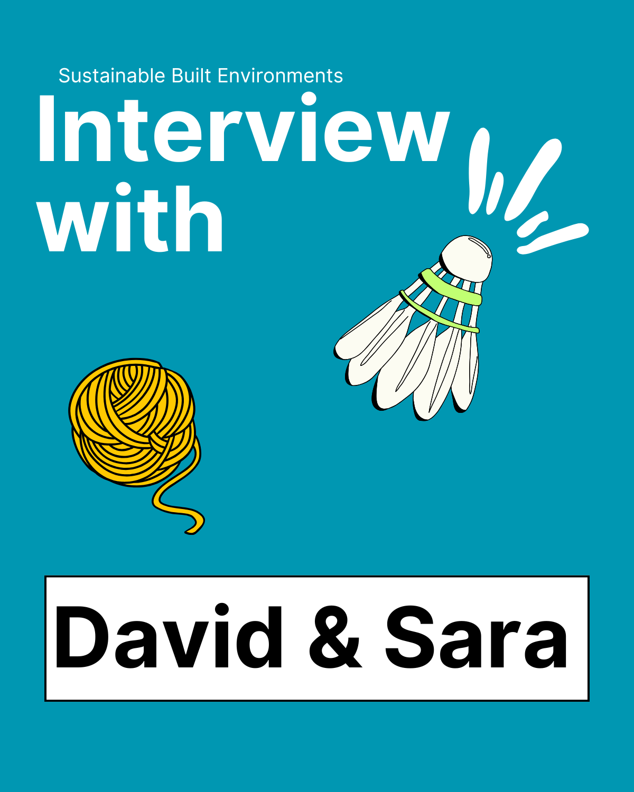
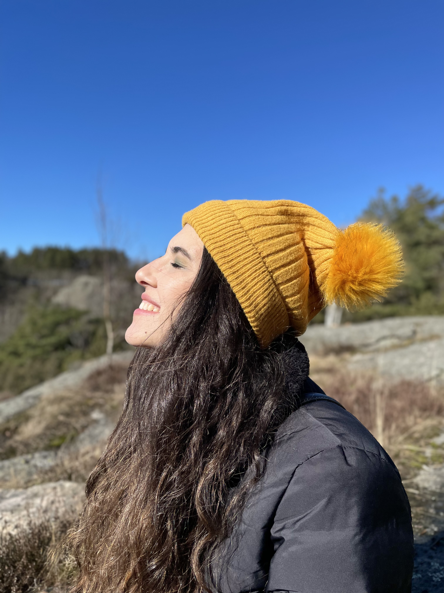
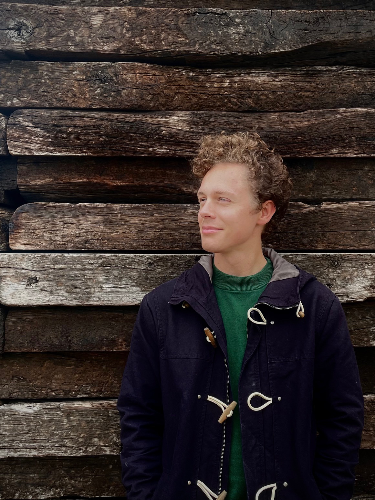

This week, we sat down with **Sara Abouebeid** and **David Sindelar**, two of our project assistants in the Sustainable Built Environments research group, to learn more about their work, research experiences, and perspectives on sustainability. From energy resilience to material stock mapping, Sara and David share their insights on the projects they are contributing to and what excites them about their research.

# Sara

**What inspired you to join the Sustainable Built Environments research group at Chalmers University?**

> I have been following the work of the SBE group for some time and have always been interested in their research. Before joining, I worked across different scales and domains, which helped me develop a broad perspective on sustainability. When the opportunity to join SBE arose, it felt like a natural next step in my journey.

**Could you tell us about the projects you are currently working on and their potential impact?**

> I am involved in two projects: Digital Twin for Positive Energy Districts (DT4PED) and Energy Communities for the Future (ECOM4Future). These projects explore ways to enhance energy resilience and decentralise energy systems in existing districts through a multi-disciplinary approach. We aim to optimise the energy performance of existing buildings, develop strategies for energy flexibility, and maximise local renewable energy generation.

**How has this experience shaped your skills, and what are you hoping to develop further?**

> I previously worked on energy modelling at the building scale, but these projects have given me the opportunity to expand my focus to the district level. Working alongside electrical engineers, mathematicians, cloud architects, and developers has helped me integrate new methodologies into my models. Moving forward, I would like to strengthen my project management skills to contribute more effectively to research coordination.

**What excites you most about the DT4PED project?**

> DT4PED is particularly exciting because it serves as a blueprint for sustainable energy transitions in Sweden. It’s rooted in a real-world case with engaged stakeholders, and I can see how my research contributes to tangible change. I’m also looking forward to publishing three research papers based on our recent findings.

**When you're not working on research, how do you like to spend your time?**

> Lately, I’ve taken up badminton and try to play once or twice a week—it’s great to have colleagues who share the same interest! On quieter days, I enjoy punch needling, especially when it’s grey outside. I also love hiking with my dog, Pucci, and I’m actively involved in Amplify Voices, a non-profit organisation that supports women from foreign backgrounds in Sweden by providing a platform to share their stories and experiences.

# David

**What drew you to the Sustainable Built Environments research group at Chalmers University?**

> With a background in architecture and adaptive reuse, I wanted to explore sustainability in greater depth and see how it can be applied to contemporary building practices. Joining the SBE research group has given me the opportunity to contribute to this field in a meaningful way.

**Could you describe the project you are currently working on and its significance?**

> I am working on developing non-residential building archetypes to map the material stock in Gothenburg’s built environment. This research is part of a broader project aimed at establishing a tool for city planners to identify building materials as a second-hand resource, supporting more sustainable construction practices.

**How has this role helped you grow, and what do you hope to gain from it?**

> This experience has challenged me to think more creatively when solving problems and has provided valuable insight into conducting research at a high level. I’ve gained a better understanding of how sustainability and resource efficiency can be integrated into urban planning.

**What excites you most about sustainable design and infrastructure?**

> For me, the most exciting aspect is the transdisciplinary nature of sustainable design. It requires thinking beyond traditional boundaries to develop solutions that address multiple complex challenges simultaneously. This kind of collaboration is both stimulating and essential for creating impactful change.

**What are some hobbies or activities you enjoy outside of research?**

> Outside of work, I am an avid badminton player and a keen bird watcher—mainly for the drama! I also enjoy spending time in the wood workshop, where I experiment with different projects (with varying degrees of success!).

We are delighted to have Sara and David as part of our team and look forward to seeing how their research contributes to the future of sustainable built environments. Stay tuned for more updates from our research group!

