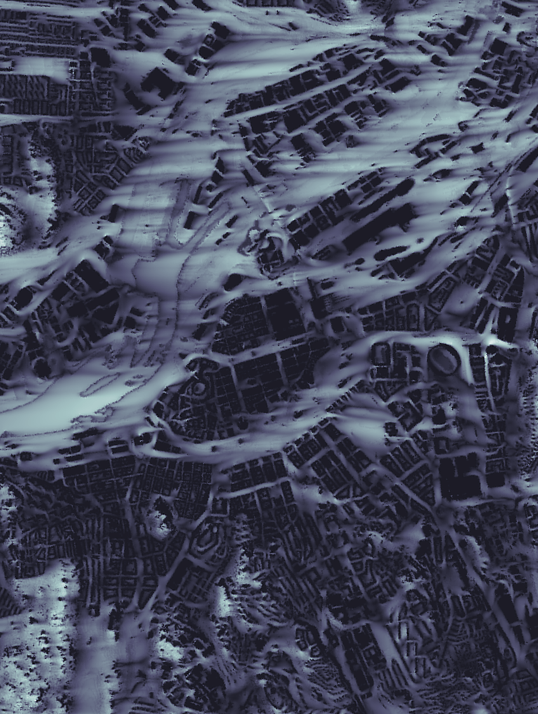
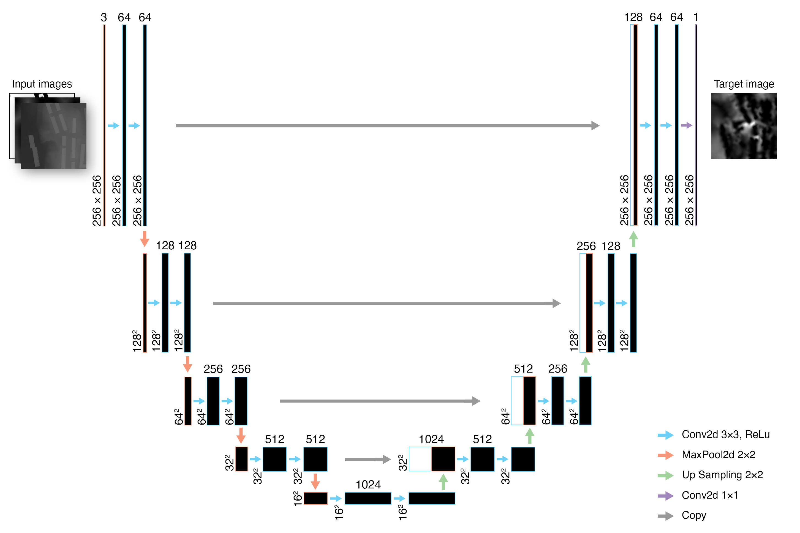

This week, we talk with **Janne**, a visiting masters student at the Sustainable Built Environments research area at Chalmers University. Janne is currently completing his MSc in Integrated Building Systems at ETH Zürich and joined the team through an IDEA League research exchange. His project applies machine learning to predict urban wind patterns, and we sat down to learn more about the challenges and potential of this exciting work.

---

**Hej Janne! Could you tell us a bit about your background—how did your path lead from ETH Zurich to Gothenburg (and SBE!), and what sparked your interest in using machine learning for CFD simulations?**

> I hold a BSc in Architecture and am currently completing my MSc in Integrated Building Systems at ETH Zürich. My interest in scientific machine learning began with a previous project focused on urban comfort analysis, particularly heat island effect prediction. Through my ETH supervisor, Prof. Guillaume Habert, I was introduced to Prof. Alexander Hollberg at Chalmers, which led to my current research exchange position funded by the IDEA League.

---

**Can you walk us through the core idea of your project? What are you trying to improve or find out by applying machine learning to urban-scale CFD?**

> The core of my project is to develop a surrogate model that predicts urban wind speeds using an image-based machine learning workflow. Current research in this area focuses on small-scale case studies, but I am exploring whether a model trained on CFD data from the entire city of Gothenburg can still deliver accurate results. The goal is to test the scalability and real-world applicability of these methods at the urban scale.

*Example of image-based wind speed prediction results over Gothenburg.*

---

**What kinds of questions or problems do you think your approach could help answer in the future?**

> The machine learning approach could replace costly, outsourced wind‑simulation studies with an instant neural‑network surrogate, putting real‑time wind feedback directly in architecture office’s design tools. Early-stage design iterations could incorporate wind comfort considerations right from the start.

*A U-Net-based convolutional neural network structure used in the image-based wind prediction model.*

---

**Have you encountered any unexpected challenges or interesting patterns while working with the simulation data? How did you deal with them?**

> A major challenge was managing watertight high resolution building and terrain geometries and generating CFD data across an entire city. Fortunately, I’ve had great support from Dr. Franziska Hunger at the Fraunhofer-Chalmers Center, who produced and provided me with a robust validation dataset.

---

**What has it been like working with the Sustainable Built Environments research area during your visit—any moments, discussions, or perspectives that stuck with you?**

> At the Sustainable Built Environment research area, I found an amazing group of people, where every opinion is valued and I felt immediately heard, even as a guest master student. Their genuine interest in my project, eagerness to connect me with the right experts, and the dedicated life/research check-ins made me feel very welcomed.

---

**You’ll be heading back home soon - what’s the first thing you’re looking forward to doing once you’re back?**

> I am very much looking forward to getting back on my bike, I’ve got some epic bike tours planned for the summer and can’t wait to go on those long rides!

---

A big thank you to Janne for sharing his project and experience with us. We’re excited to see how his work contributes to real-time environmental feedback in urban design and planning.

---

## Read More

- [Prof. Dr. Guillaume Habert – ETH Zurich](https://sc.ibi.ethz.ch/en/people/prof-dr-guillaume-habert.html)  
- [Fraunhofer–Chalmers Centre for Industrial Mathematics](https://www.fcc.chalmers.se/departments/comp/)  
- [Institute of Construction and Infrastructure Management (IBI), ETH Zurich](https://ibi.ethz.ch/)  