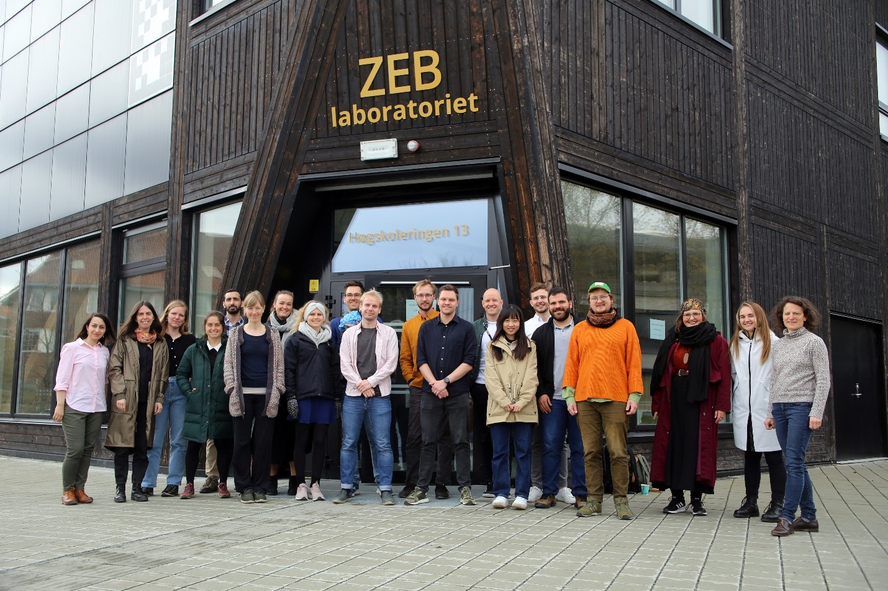

The first Nordic Built Environment LCA PhD student forum was successfully launched on May 9th and attracted 18 international PhD students working with Life Cycle Assessment (LCA). 
On the first day, the PhD students presented their work in two parallel sessions, which included many very engaged discussions. The topics included circularity assessment, absolute sustainability, historic LCA, renovation, Building Information Modelling (BIM), Artificial Intelligence (AI) amongst many others. 
On the second day, Eirik Resch and Freja Nygaard Rasmussen shared their experiences from their recently finished PhD projects. In the following workshops, the PhD students had the chance to start hands-on collaboration on different common themes. The students’ engagement and their very positive feedback showed the high demand for such opportunities for informal peer to peer exchange and collaboration.
The forum was held at the ZEB lab in Trondheim and was organized in a joint effort by Norwegian University of Science and Technology (NTNU), Aalborg University, Chalmers University of Technology, Royal Institute of Technology (KTH), and Aalto University. The forum was supported by the Research Centre on Zero Emissions Neighborhoods in Smart Cities (ZEN). We look forward to the next forum in 2023. Stay tuned!
