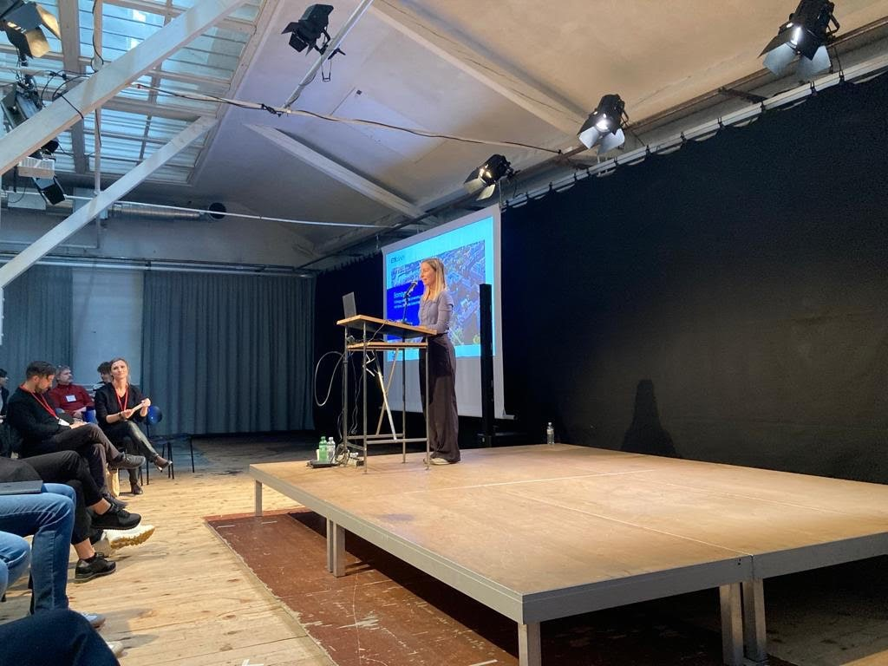

On Friday 17th March, the Bombyx team has attended the Rhino user [meeting](https://events.mcneel.eu/rhino-user-meeting-basel/) organized by McNeel in collaboration with Herzog de Meuron – 
Bombyx is a design-integrated tool for real-time Life cycle assessment (LCA), which was created to facilitate the use of LCA during the early design stage of a building. Bombyx is based on 3D software Rhinoceros and grasshopper as a visual programming language. 

During the presentation, the structure of the tool was shown along with the workflow of simplified LCA. We are glad to announce that recently Bombyx was  also successfully merged with Hive, the energy analysis tool created by the chair of Architecture and building systems at ETH Zurich. The future development of Bombyx includes the visualizer, carbon storage assessment, and future climate projections. 
   
<strong> Read more </strong>
  
[See the McNeel's event page](https://events.mcneel.eu/rhino-user-meeting-basel/)  
[See the Bombyx tool on Food4Rhino](https://www.food4rhino.com/en/app/bombyx) 
