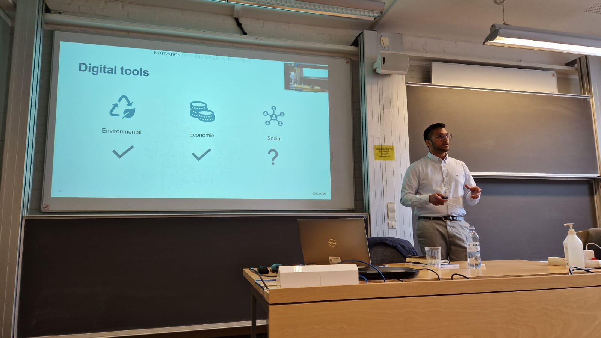
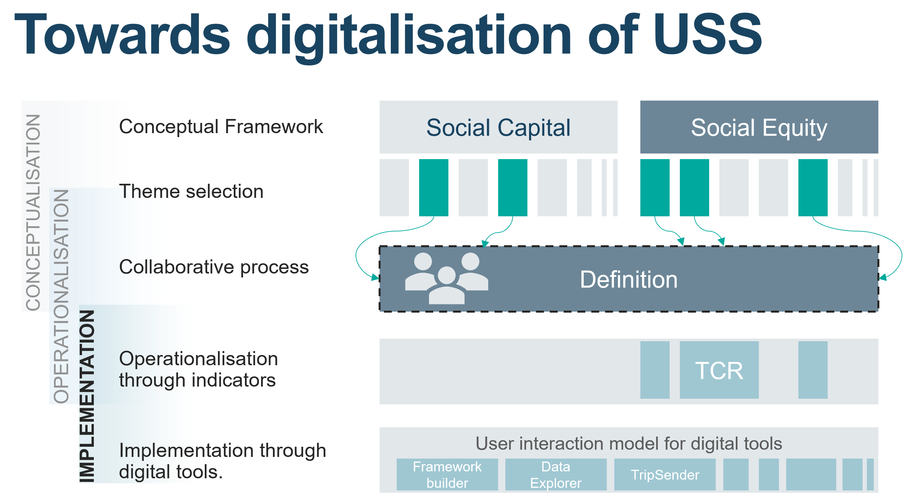

Sanjay Somanath held his public presentation of his licentiate thesis on "Towards digitalisation of social sustainability: Digital tools for socially sustainable neighbourhood design" on the 3rd of June 2022.

**Thesis title**      : Towards digitalisation of social sustainability: Digital tools for socially sustainable neighbourhood design  
**Main Supervisor**   : [Liane Thuvander](https://www.chalmers.se/en/staff/Pages/liane-thuvander.aspx)  
**Co-supervisor**     : [Alexander Hollberg]()   
**Examiner**          : [Holger Wallbaum]() 

On 3rd of June 2022, Sanjay Somanath Sanjay Somanath held his public presentation of his licentiate thesis on "Towards digitalisation of social sustainability: Digital tools for socially sustainable neighbourhood design".
The discussion leader for the seminar was [Prof.dr. Geord Vrachliotis](https://www.tudelft.nl/bk/over-faculteit/hoogleraren/profdr-g-vrachliotis). Georg is a professor in Theory of Architecture and Digital Culture at the Department of Architecture, TU Delft in the Netherlands.

Social Sustainability is an important aspect of Sustainable development in the built environment but does not enjoy the benefits of digital tools in the same way that the economic and environmental dimensions do. In his thesis Sanjay presents reasons for why this is and how reconceptualising Urban Social Sustainability could be a solution.

In his thesis, Sanjay presents the re-conceptualisation of Urban Social Sustainability as:

<strong><i>“A phenomenon observed in society when a positive human condition is achieved through social equity and social capital as a result of the built environment”</strong></i>
  

   
<strong> Read more </strong>
- [Project page]()  
- [Project on GitHub](https://snjsomnath.github.io/PhDThesisRepo/)  
- [Read more on Chalmers Research](https://research.chalmers.se/en/publication/530311)  
