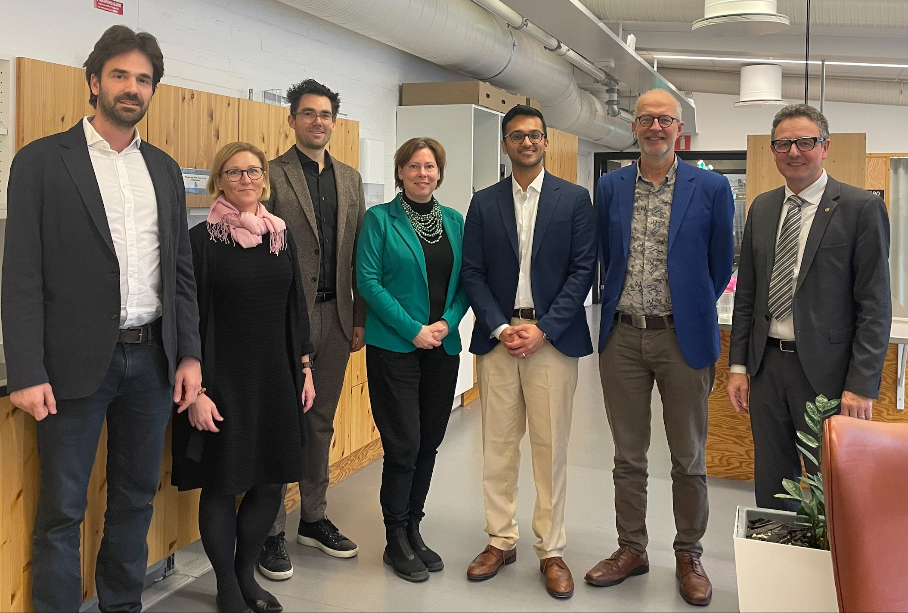
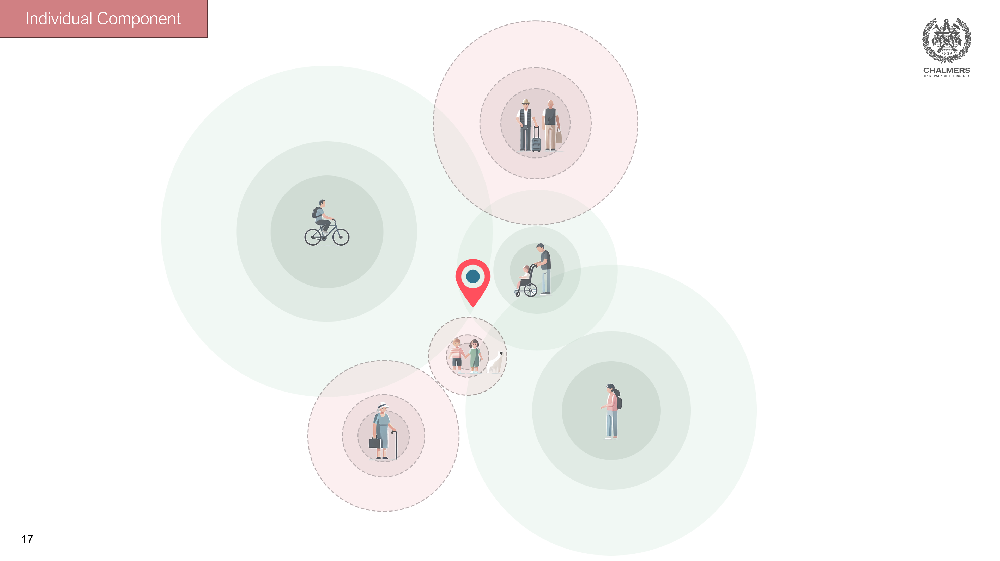

On 29th November, Sanjay Somanath successfully defended his PhD thesis, titled *"Instruments of Inquiry for Urban Social Sustainability: Activity-Based Urban Accessibility Modelling in Neighbourhood Planning,"*. 

In his thesis, Sanjay explored questions such as, *"How can urban practitioners incorporate residents' perspectives into neighbourhood planning?"* and *"How can computational methods help operationalise urban social sustainability?"* through the lens of activity-based urban accessibility modelling. Below are some of the findings from Sanjay's research:

Urban social sustaianability (USS) has been refered to as a "concept in chaos" and an "under-theorised topic". The research showed that there are two overarching categories of USS, social capital and social equity. While practitioners cannot directly influence residents' social capital social equity lies within the practitioners scope of influence. One of the ways through which practitioners influence residents social equity is by providing equitable access to social and physical infrastructure.

On the theorisation of USS, the research also looked into how practitioners conceptualised, and operationalised the concept, identifying an inbetween stage of re-conceptualisation. Re-conceptualisation is where the vague concept is concretised based on stakeholder participation and various planning tools.

The methodological contribution of Sanjay's work is the development of an Activity Based Model of neighbourhood accessibility. To include the individual perspective in neighbourhood analysis, Sanjay developed a model that recreates existing neighbourhoods digitally and creates artificial residents that represent the actual population of the neighbourhood. Using this model, practitioners can ask "what if?" questions and can then look into how different residents would perform in new neighbourhood plans.

 
More information about the PhD thesis can be found [here](https://research.chalmers.se/en/publication/543425).

---