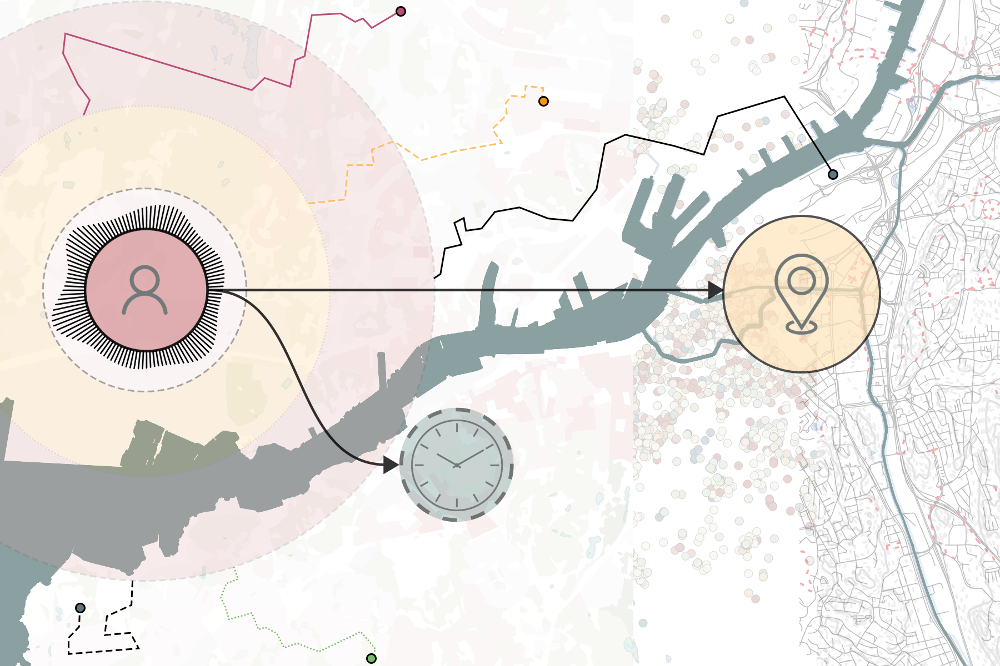

On 15th November, Sanjay Somanath was interviewed by [Catharina Björk](https://intranet.chalmers.se/en/find-colleague/my-profile/?cid=cbjork) about his research and PhD life. Sanjay is set to defend his PhD thesis, titled *"Instruments of Inquiry for Urban Social Sustainability: Activity-Based Urban Accessibility Modelling in Neighbourhood Planning,"* on 29th November. 

In his thesis, Sanjay explores questions such as, *"How can urban practitioners incorporate residents' perspectives into neighbourhood planning?"* and *"How can computational methods help operationalise urban social sustainability?"* through the lens of activity-based urban accessibility modelling.

Read the full interview with Catharina Björk [here](https://intranet.chalmers.se/en/current/news/ace-phd-interview-sanjay-somanath/).  
More information about the PhD thesis can be found [here](https://research.chalmers.se/en/publication/543425).  

---