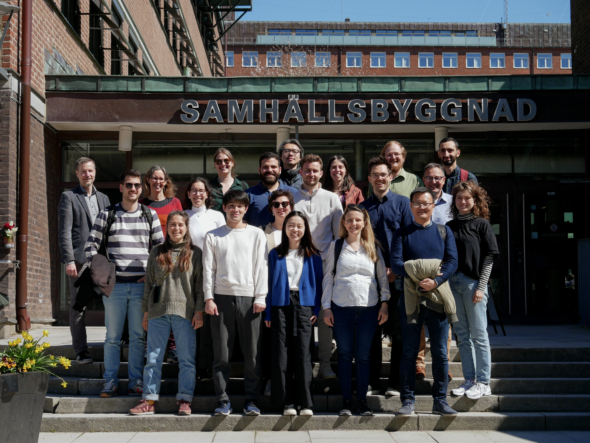

On May 3rd and 4th, the second Nordic Build-LCA PhD forum took place at Chalmers. In total, 16 PhD students joined to discuss their ongoing work, latest results, and open challenges. Many new connections were made and new collaborations kicked-off!

The first day started with a welcome presentation by Alexander Hollberg, who hosted the event together with Holger Wallbaum. Tove Malmqvist Stigell from KTH in Stockholm and Matti Kuittinen from Aalto University in Helsinki also joined in Gothenburg and hosted the presentations sessions. In two parallel sessions, the PhD students had 15 minutes to present followed by 15-minute discussions. Two opponents had prepared questions for each presentation beforehand which results in very engaged discussions with very constructive comments. The topics ranged from renovation of residential buildings and circularity assessment linked to LCA to wind towers or the environmental effects of concrete blocks in the ocean.
In the afternoon, Nicolas Francart a former PhD student at KTH and now a postdoc at the BUILD department of Aalborg University shared his personal insights into the big questions of what happens after the PhD. The following discussion highlight the challenges of young academics, such as finding work-life balance and mental health but also the big advantages such as freedom and the excitement to explore any field one is interested in. 
A workshop lead by Matti Kuittinen highlighted the increasing uptake of LCA in national and European regulations and shed light on the needs of the future practitioners. It became clear that there will be enough to do for all the attending PhD students and that policymakers will need their expertise.  Finally, the evening ended by a guided city tour by Anna Wöhler in perfect sunny weather and a joint dinner in the city center.

The second day followed a similar structure with parallel sessions in the morning and a workshop about visualization and communication of LCA results in the afternoon. The final feedback round clearly showed that this kind of informal settings to share experiences and challenges from PhD student to PhD student are highly appreciated by the students.

The next forum will take place in Helsinki in May 2024. The call for abstracts will probably be announced end of 2023. We look forward to seeing everyone again and hope to meet new PhDs from all the Nordic countries!