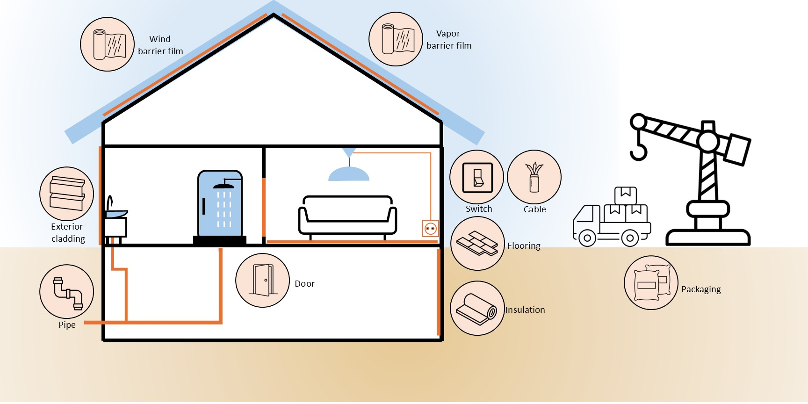

Congratulations to Shuang Wang on successfully defending her Licentiate thesis titled: *"Characterizing the construction sector’s potential as secondary plastic provider."* Her research focuses on the circularity of plastics in the construction sector, a critical area for sustainability in the built environment. We sat down with Shuang to ask some questions after the licentiate defence. In this interview, Shuang shares her experience of the defense, key insights from her research, and her aspirations for the next stage of her PhD.

**Congratulations, Shuang! How does it feel to have defended your Licentiate?**

>  Thank you. First of all, I feel relaxed as I don’t have any other deadlines so far. I also feel that I gained energy for the coming year as I finally got positive feedback. PhD study is difficult as it usually takes a long time to see the feedback of what you have done, like publishing a paper can take even one year. Always making efforts without getting positive or tangible feedback is a terrible experience, at least for me. So I feel happy that I prepared for the defence and got the Licentiate degree within four months.

**Reflecting on your Licentiate, what were the most important insights from your research so far?**

>  My aim and scope became clearer. At the beginning of PhD, I was quite ambitious, wanting to cover everything. Now I narrow down my scope, but in a good way. That is to say I know the focus and understand the extra parts that can be uncovered by my research. With these in mind, I have a better plan for the rest of my PhD project.

**What has your time at Chalmers been like so far?**

>  It has been quite peaceful. I have some teaching tasks but I can concentrate on my own research most of the time. The only pity I have is that I feel like I work alone too much and do not have enough interactions, connections, and communications with other researchers at Chalmers.

**What are your next steps as you move toward the second half of your research?**

>  My next steps are to conduct more case studies, quantifying plastic materials flows of different buildings. Also, I will do site observation and interviews, getting insights from the industry.

**Now that you have reached this milestone, will you take some time off - what would you like to do?**

>  Of course, I have to and I think I deserve it, haha. I cannot take vacation immediately as I have teaching tasks. But I will take one month vacation in March, going back home and spending time with my parents and grandparents.

Once again, congratulations to Shuang Wang on this significant achievement! Her work on construction plastic circularity holds great potential for sustainability, and we look forward to following her continued research. We wish her the best in her upcoming projects and hope she enjoys a well-deserved break before diving into the next phase of her PhD.

   
<strong> Read more </strong>
- [Read more on Chalmers Research](https://research.chalmers.se/en/publication/544686).
---