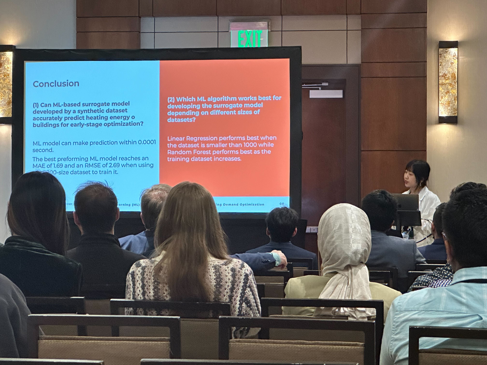

Denver, Colorado, May 23rd.

Xinyue Wang presented at the IBPSA-USA SimBuild 2024 Conference, held May 20th through Thursday, May 23rd, 2024, in Denver, Colorado, United States. The conference’s theme is “Building Sustainability and Performance Through Simulation”. It looked into demonstrating innovation in methods, workflows, and modeling tools for better building design, performance, and operation to meet aggressive targets for energy reduction, environmental quality, decarbonization, and resiliency.

Xinyue presented the paper titled ‘Machine Learning (ML) as Surrogate Model for Early-stage Heating Demand Optimization’. The paper investigated which ML algorithms perform best concerning the size of the training dataset in developing a machine learning (ML) surrogate model to replace the heating demand simulation process in early-stage optimization. The results showed that Linear Regression performs best when the dataset is smaller than 1000 while Random Forest performs best when the training dataset increases above 1000. The best-performing developed ML model can predict building energy demand within 0.00005 seconds with high accuracy. The paper demonstrates the feasibility of using an ML surrogate model to substitute the energy simulation engine in a more efficient early-stage energy optimization process.
