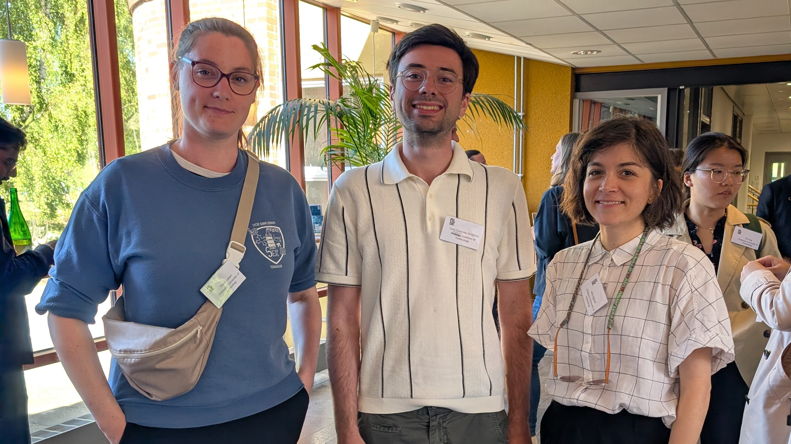

Last week, a few of us attended the third Swedish Circular Economy colloquium that took place in Gothenburg. It was great to see more people coming from different industries and backgrounds, all focused on the same idea. That made starting conversations really easy, and we got to catch up with some colleagues. 

Among other highlights from our team: Maud Lanau led a breakout session on circularity in the built environment, and both Luca Giacomo Invidiato and Aida Eghbali connected with other researchers, opening the door for potential future collaborations!

Thanks to all the organizers, speakers, and attendees for making it such a great day!

---

## Read More

- [Mélanie Despeisse’s recap on LinkedIn](https://www.linkedin.com/posts/melanie-despeisse_today-was-our-third-swedish-circular-economy-activity-7330697671378186240--VLI)  
- **Event details: Swedish Circular Economy Colloquium**
  - **Date:** 20 May 2025  
  - **Time:** 10:00 – 16:00 (coffee from 09:30; networking 16:00 – 17:00)  
  - **Location:** [RISE Research Institutes of Sweden, Frans Perssons Väg 6, Gothenburg](https://www.ri.se/en)  
  - **Seats available:** 80  
  - **Language:** English  

The colloquium is co-hosted by RISE and Chalmers University of Technology and brings together researchers to share insights, foster collaboration, and advance circular economy innovation in Sweden. More information is available on the RISE website.
