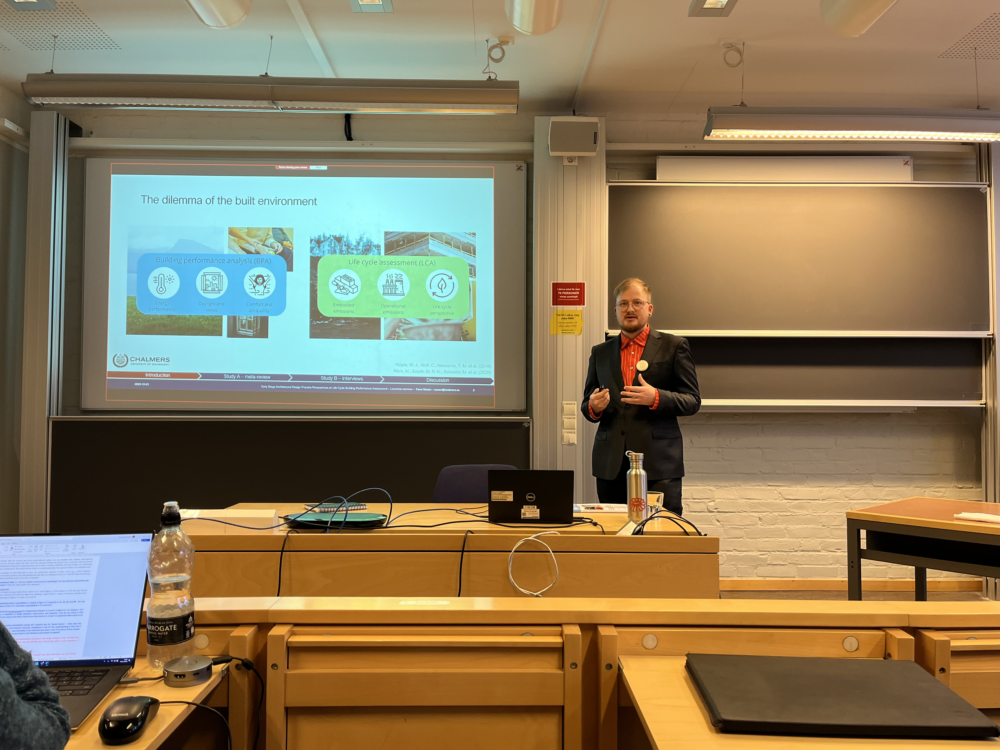
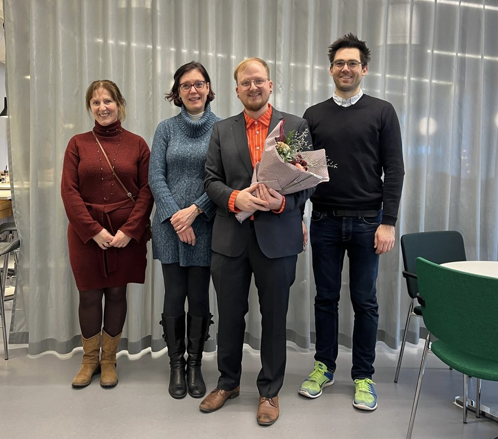

On December 1st, Toivo Säwén conducted his Licentiate seminar defending his thesis entitled "Early Stage Architectural Design Practice Perspectives on Life Cycle Building Performance Assessment". 
We were joined by [Prof. Clarice Bleil de Souza](https://profiles.cardiff.ac.uk/staff/bleildesouzac) of the chair of Design Decision Making, Cardiff University, as discussion leader. The day was filled with interesting research exchange and concluded with a workshop on the topic *"Mapping decision-making in the build environment: Facilitating integrated building design and operation for sustainability"*

The Licentiate thesis is available[here](https://research.chalmers.se/publication/538257).