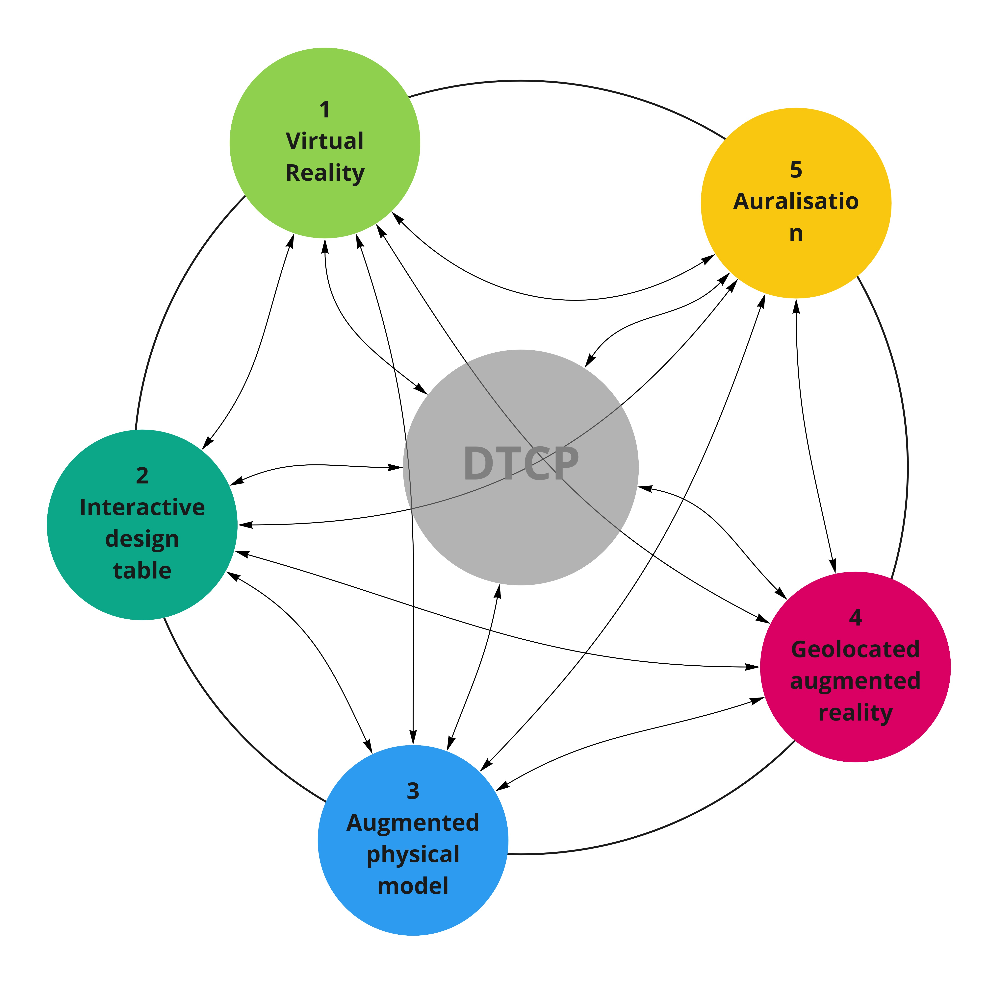

On April 6th 2021, the DTCC Twinable project was succesfully kicked off with an online workshop. 18 participants from 9 different partner organisations joined the workshop using Miro. We look forwand to continues successful collaboration in the next four years of the project!
