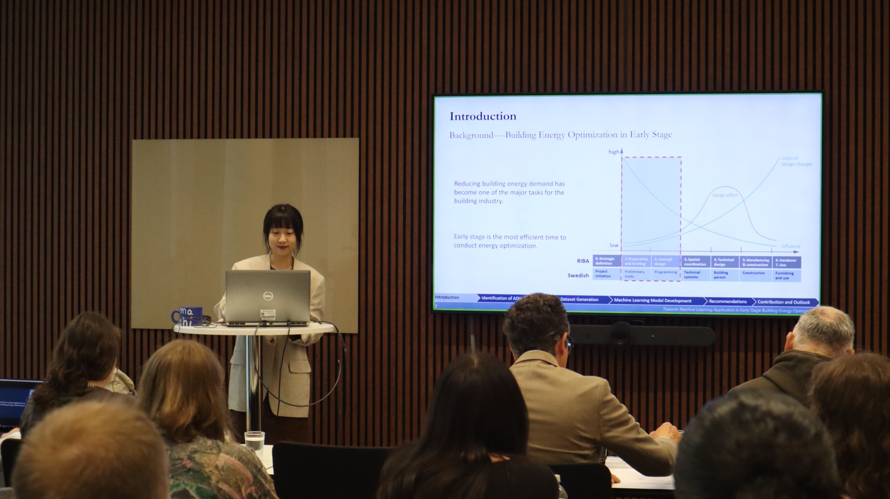

On June 10th, Xinyue Wang presented at her Licentiate seminar defending her thesis entitled 'Towards Machine Learning Application in Early-Stage Building Energy Optimization'. Her thesis discusses how to develop a machine learning building energy prediction model to substitute the traditional simulation engines in early stage optimization workflow for higher efficiency. Professor [Paul Sheperd](https://researchportal.bath.ac.uk/en/persons/paul-shepherd), from the University of Bath, was invited as the discussion leader.

More information about the licentiate thesis can be seen [here](https://research.chalmers.se/publication/541165).