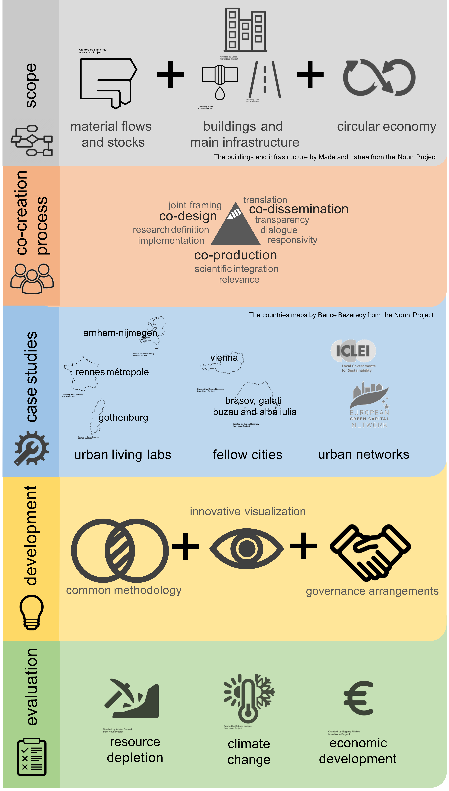

<!--- 
 
-->

### Project Overview

  

    
    The CREATE project aimed at supporting urban transformation processes towards the circular economy by developing a tool (CREATE tool) that makes an inventory of the existing material stocks in the built environment and explores scenarios for future expected material flows from renovation and demolition activities. Additionally, the CREATE project aimed at proposing governance arrangements on how to approach the circular economy transition. The project focused on buildings in 4 cities in Europe, Gothenburg, Sweden, Rennes Métropole, France, Nijmegen, the Netherlands and Vienna, Austria. Construction materials, elements, and components such as concrete, steel, windows, tiles are accounted for, both the amounts that exist accumulated in the stock of buildings, but also the inflows needed for new construction, renovation, refurbishment and the outflows of construction and demolition waste.  A transdisciplinary consortium worked with a mixed research design that integrates quantitative modelling with qualitative studies and design of governance aspects. The CREATE project also focused on improving already existing, validated, and applied tools and arrangements and combined them with new digitalization technologies to inform decision-makers and enable a circular built environment. 
  

### Main Outcomes

Important outcomes of the project from the different Work Packages include:  

- WP2 identified the stakeholder needs to stimulate reuse and recycling of materials in the built environment and developed a data enrichment action plan and conceptual model to allow for the development of the CREATE tool and support governance arrangements;  

- WP3 defined the user stories for stakeholders that will use the CREATE tool, designed the architecture and functionalities of the tool for the needs from the Living Labs and developed the CREATE tool;  

- WP4 identified best practices for decision support methods with a focus on Nijmegen Living Lab and to a lesser extent the Rennes Métropole and Gothenburg Living Labs, and analyzed the governance context (policy instruments) for all the Living Labs. This knowledge was used to identify best practices, Circular Econonmy in the Built Environment (CEBE) implementation in terms of tender procedures, policy coherence and evidence-based policy making and to develop policy recommendations.   

- WP5 established an LCA-based impact assessment approach within co-creation process with local stakeholders based on OpenLCA model. A 4 steps method was applied in the Gothenburg, Rennes and Vienna Living Labs to assess circular economy scenarios and their impacts on material and energy saving and CO2-reduction. 

- WP6 conducted multiple communication and dissemination activities, in particular, participation in national and international conferences for scientists and practitioners, development of webinars to disseminate the project results and developing and teaching educational materials at Master's level. 

### Work Package Structure

The CREATE project follows a set of strategic underpinnings that connect the different work packages in three dimensions:

### Timeline

### Funding program

The CREATE project has received funding from the European Union’s Horizon 2020 research and innovation programme under grant agreement No 875022.

## Urban LivingLabs

### About LivingLabs

JPI Urban Europe definition:  

A forum for innovation, applied to the development of new products, systems, services and processes in an urban area; employing working methods to integrate people into the entire development process as users and co-creators to explore, examine, experiment, test and evaluate new ideas, scenarios, processes, systems, concepts and creative solutions in complex and everyday contexts.

### Key components:

There are 4 key components of a Living Lab.

### Steps of LivingLabs

There are 2 phases with 6 steps respectively for a Living Lab, starting with a pre phase and following by a development phase

### Case Studies

* Nijmegen in the Netherlands
* Gothenburg in Sweden
* Rennes Metropolitan area in France
* Vienna in Austria

### Webinar on the CREATE Project

<iframe width="560" height="315" src="https://www.youtube.com/embed/7PFl0DDYzr0?si=VcAkgMy-CJRPAE4F" title="YouTube video player" frameborder="0" allow="accelerometer; autoplay; clipboard-write; encrypted-media; gyroscope; picture-in-picture; web-share" referrerpolicy="strict-origin-when-cross-origin" allowfullscreen></iframe>

### DTCC Milestone Project Lunch Seminars
<iframe width="560" height="315" src="https://www.youtube.com/embed/jyoRbiPOzQQ?si=K52XKnxqRkReCH1v" title="YouTube video player" frameborder="0" allow="accelerometer; autoplay; clipboard-write; encrypted-media; gyroscope; picture-in-picture; web-share" referrerpolicy="strict-origin-when-cross-origin" allowfullscreen></iframe>

## Project results/ Deliverables

### Overarching Goals

1. Develop and visualize an overview of material stocks and flows that are part of the built environment, 
2. Provide tailored software solutions to cities that support a circular built environment, and 
3. Co-create governance arrangements that enable a broader participation of stakeholders, experimentation with 
   decision-support information, and the upscaling of best practices. 

# Deliverables

## Avaliable deliverables

Click [*here*](https://github.com/SB-Chalmers/sustainable_building_website/tree/main/content/project/CREATE/deliverables) to access the deliverables folder

<!--   Remove this line to uncomment

## Project Team

<small>(Left to Right) [Holger Wallbaum (Chalmers)](https://www.chalmers.se/personer/wallbaum/), Sophia Pibal (AIT), Maarten van Ginkel (Nijmegen Municipality), Vincent Augiseau (CitéSource), Ali Hainoun (AIT), Maud Lanau (Chalmers), David Sindelar (Chalmers), Daniel Horak (AIT), Tara Heshusius (Nijmegen Municipality), Daniel Monfort (BRGM), Wieke Pot (Wageningen University and Research), Angeline Chartier (Wageningen University and Research), Leonardo Rosado (Chalmers)</small>

   Remove this line to uncomment-->
