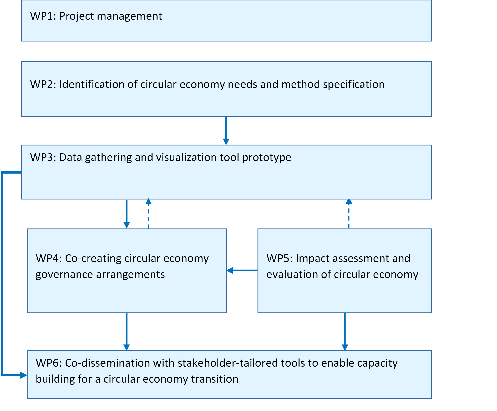
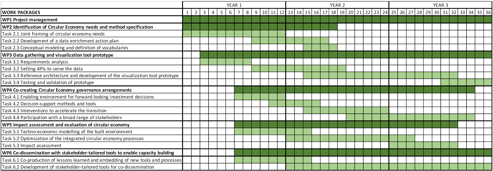
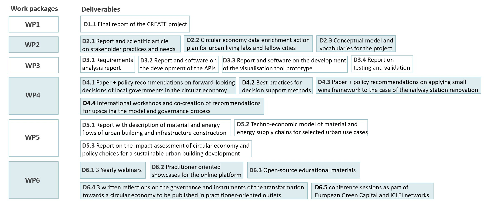

---

title: CREATE
subtitle: The Carbon Resource Energy and Adaption Toolbox Europe
summary: The Carbon Resource Energy and Adaption Toolbox Europe (CREATE), is a comprehensive modelling and data toolbox that can overcome problems such as - How, and at which costs can ambitious climate change mitigation goals be reached? How can urban planning be developed while simultaneously tackling climate change? How can the long-term economic and environmental performance of the building stock be optimized? How to plan electricity, gas, and thermal networks to suit future energy demand and the existing urban topology?
date: 2022-07-04 00:00:00
draft: false
featured: false
tags:
  - Climate policy
  - Urban model 
  - Local energy policies
  - Local and regional energy planning
  - DigitalTools
  - Projects

categories:
  - Projects
authors:
  - leonardo-rosado
  - holger-wallbaum 
  - Maud Lanau
external_link: ""
image:
  caption: CREATE Scheme

  filename: featured
  focal_point: Smart
  preview_only: false
---


## About Create
CREATE project aims at supporting urban transformation processes towards the circular economy by making an inventory of 
the existing material stocks within urban construction, developing reliable scenarios for future expected material 
flows, and providing governance arrangements on how to approach the circular economy transition. 

The project will focus on the largest urban infrastructures and communal assets, namely buildings, municipal roads, 
water, and wastewater pipes. A truly transdisciplinary consortium will work with a mixed research design that integrates 
quantitative modelling with qualitative study and design of governance aspects. The project will further improve already 
existing, validated, and applied tools and arrangements and combine them with new digitalization technologies to inform 
decision-makers and enable a circular built environment. 

This will be achieved by engaging with a wide range of 
stakeholders in a co-creation process with three urban living labs and six fellow cities in five countries, which 
will result in numerous capacity building moments throughout the entire project. A thorough analysis of best practices 
of cities steering the circular economy transition together with new governance interventions will result in concrete 
proposals of tailored governance arrangements for the participating cities including a concrete proposal for an upscaling 
strategy for Europe.  
 

## Work Package Structure
The CREATE project follows a set of strategic underpinnings that connect the different work packages in three dimensions:
1.	A living lab approach that is used throughout all work packages and allows for an integrated co-production of the project with stakeholders from the quadruple helix;
2.	A multi-scalar capacity building approach, where the use of the living labs as the focal point of the work developed, complemented by the dissemination of knowledge to fellow cities and an outreach to urban networks in Europe, will allow for an optimized scalable process;
3.	A tailored and adaptable approach that is based on the pre-existing conditions of the urban living labs and fellow cities, i.e, existing data, methods and governance procedures already being utilized by the stakeholders and providing them with new knowledge.
Through these three dimensions of concepts, the 6 work packages within CREATE project are structured and interlinked as below:

## Timeline

## Funding program

The CREATE project has received funding from the European Union’s Horizon 2020 research and innovation programme under 
grant agreement No 875022.

## Urban LivingLabs
### About LivingLabs
JPI Urban Europe definition:  
A forum for innovation, applied to the development of new products, systems, services and processes in an urban area; 
employing working methods to integrate people into the entire development process as users and co-creators to explore, 
examine, experiment, test and evaluate new ideas, scenarios, processes, systems, concepts and creative solutions in 
complex and everyday contexts.

### Key components:  
There are 4 key components of a Living Lab.

### Steps of LivingLabs
There are 2 phases with 6 steps respectively for a Living Lab, starting with a pre phase and following by a development 
phase

## Case Studies
-	Nijmegen in the Netherlands
-	Gothenburg in Sweden
-	Rennes Metropolitan area in France

### Olof Asklunds gata

Redevelopment of an industrial area in Södra Änggården into a residential area with apartment buildings, a park, a 
square, a school, etc. 

Traffic Waste and Wastewater office of Gothenburg will be involved in a project that concerns all streets and public 
land, including other infrastructure such as water and wastewater, electricity, energy, etc.

### Area TBD (Framtiden)
### Fellow cities

## Partners

Chalmers University of Technology (CTH)

Austrian Institute of Technology (AIT)

CitéSource (CS)

Wageningen University and Research (WUR)

Municipality of Nijmegen (MoN)

French Geological Survey (BRGM)

BEIA Consult International (BEIA)

Brasov Metropolitan Agency for Sustainable Development (BMA)

Göteborgs Stad, Kretslopp och vatten (GS)

## News
Updates will be added to this space as the project progresses

## Project results/ Deliverables
### Overarching Goals
1.	develop and visualize an overview of material stocks and flows that are part of the built environment, 
2.	provide tailored software solutions to cities that support a circular built environment, and 
3.	co-create governance arrangements that enable a broader participation of stakeholders, experimentation with 
    decision-support information, and the upscaling of best practices. 

### Deliverables

[To Project page](https://research.chalmers.se/en/publication/517254)
