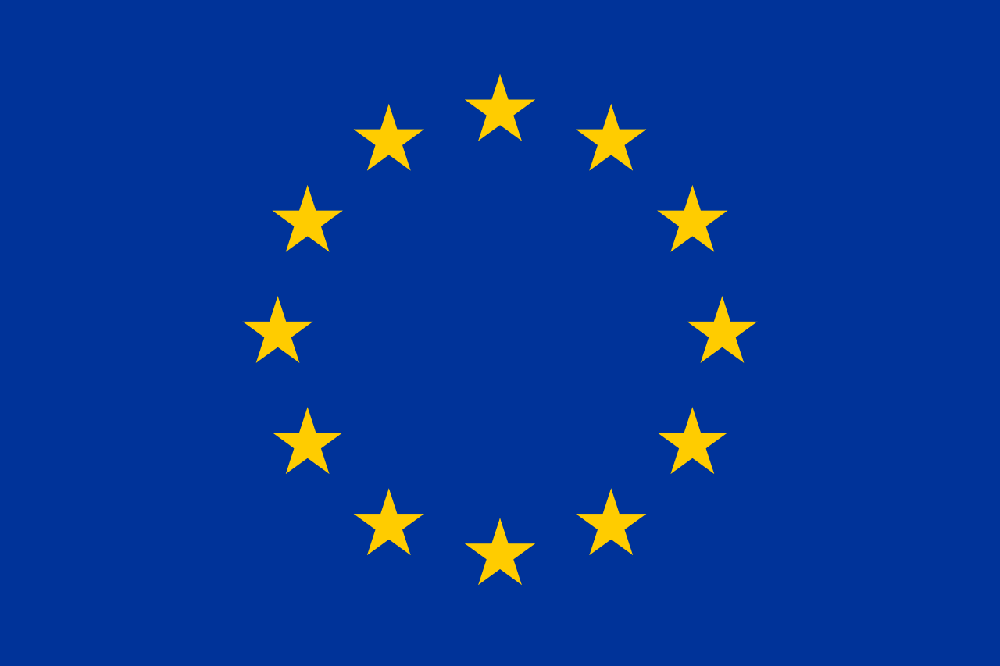

---

title: EqualHouse
subtitle: From Housing Inequality to Sustainable, Inclusive and Affordable Housing Solutions
summary: EqualHouse aims to identify, analyse and tackle the most significant dimensions of housing inequality across Europe. Designed with both transdisciplinary and interdisciplinary elements, EqualHouse will provide housing policymakers and other key stakeholders with robust, evidence-based guidance on how to address these inequalities in a sustainable, inclusive and affordable way. The project has received funding from the European Union’s Horizon 2023 research and innovation programme under grant agreement No 101132325. We are working within a consortium of 12 partners from around Europe. 
date: 2024-01-01 00:00:00
draft: false
featured: false
tags:
  - Affordable and Climate-Neutral Housing
  - Housing Inequality
  - Retrofit
  - Projects

categories:
  - Projects
authors:
  - Emiline Elangovan
  - holger-wallbaum 
  - Liane Thuvander
external_link: ""
image:
  caption: Supported by the EU Horizon 2023 research and innovation programme under grant agreement no. 101132325 

  filename: featured
  focal_point: Smart
  preview_only: false
---

[To Project page](https://research.chalmers.se/en/project/11528)

EqualHouse aims to identify, analyse and tackle the most significant dimensions of housing inequality across Europe. Designed with both transdisciplinary and interdisciplinary elements, EqualHouse will provide housing policymakers and other key stakeholders with robust, evidence-based guidance on how to address these inequalities in a sustainable, inclusive and affordable way. The project involves a consortium of 12 project partners from around Europe and is funded by the 2023 EU Horizon programme.

Chalmers University of Technology will provide expertise in tackling energy poverty and unsustainable housing. Emiline Elangovan, a PhD student part of the Sustainable Building research group, will work closely with EqualHouse in her doctoral research with the support of Holger Wallbaum (project lead Chalmers and co-supervisor) and Liane Thuvander (main supervisor). 

Project partners:
* Charokopeio Panepistimio (Greece)
* Comite Europeen De Coordination De L'habitat Social AISBL (Belgium)
* Federation Europeenne D’associations Nationales Travillant Avec Les Sans-Abri (Belgium)
* International Union of Tenants (Sweden)
* Just Cities (Netherlands)
* University College Dublin (Ireland)
* University of Glasgow (United Kingdom)
* Katholieke Universiteit Leuven (Belgium)
* Perfieria Kozpolitikai Es Kutatokozpont KFT (Hungary)
* Tilburg University (Netherlands)
* Uniwersytet Warszawski (Poland)

<!--  -->

